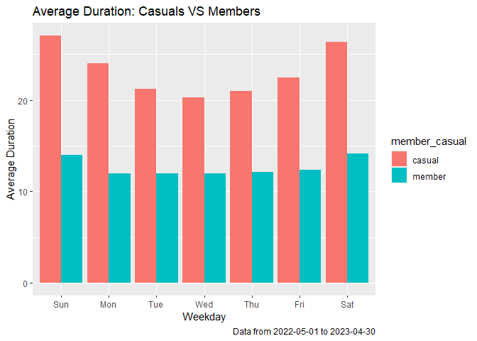
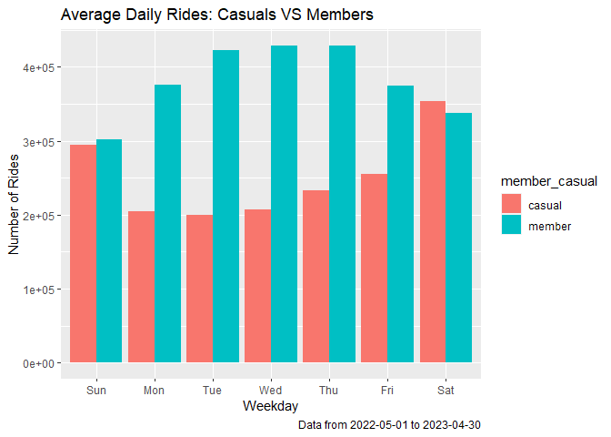
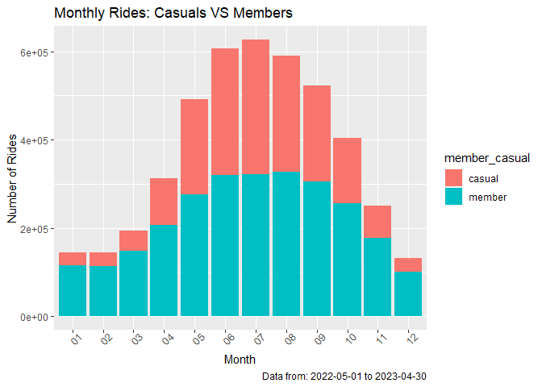
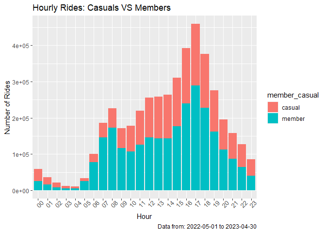
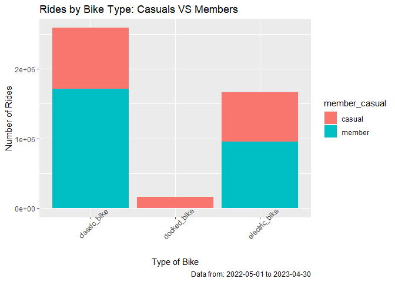
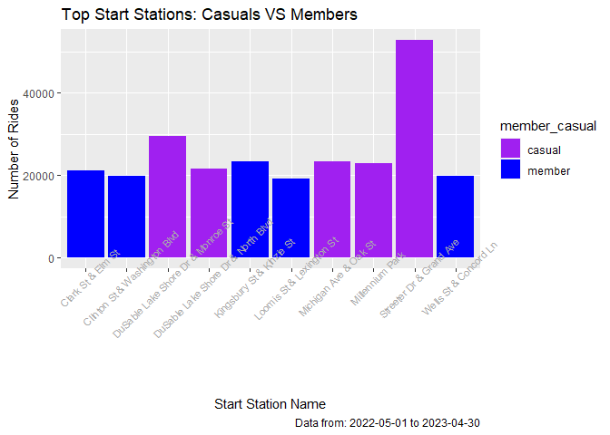
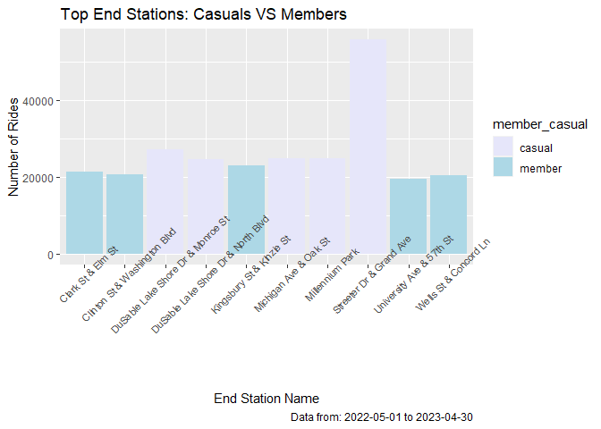
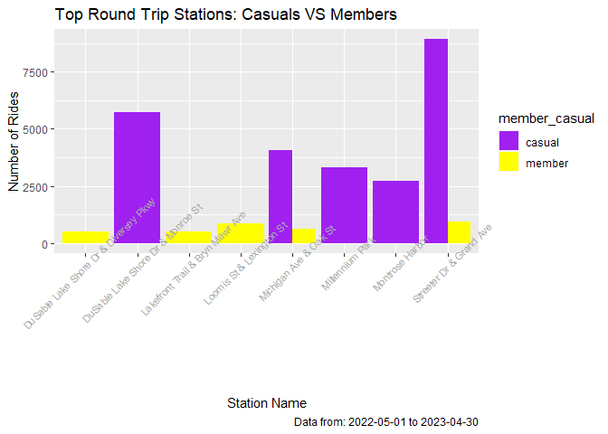

### **Introduction**  
  
**Case - How to optimize the amount of annual memberships?**

I used historical data from a bike-share company located in Chicago, IL, USA to *analyze how casual riders and annual members use bikes differently*. Annual members are more profitable than casual riders, so the goal is to maximize the number of annual members for future company growth.  

  
  
### **ASK**  
  
**Key Task:**  

1. Business task: **analyze the different ways riders use the bike-share service to identify historical trends and convert casual riders into annual members in order to grow the company.**  
  
  
### **PREPARE**  
  
**Key Tasks:**  

1. Download data and store it appropriately.  
2. Identify organization of the data.  
3. Determine credibility of the data.  
4. Sort and filter data.  
  
12 months worth of data was downloaded from [divvy](https://divvy-tripdata.s3.amazonaws.com/index.html) and stored on a password protected hard drive. The data is organized into monthly CSV files. The data has been made publicly available by Motivate International Inc. under this [license](https://ride.divvybikes.com/data-license-agreement). The data contains no personal identifiable information and was collected from **May 1, 2022 to April 30, 2023**.  
  
**The data is:**  

* **RELIABLE** - Yes, the data sample is representative of the population of Cyclistic riders because it includes 12 months worth of data.  
* **ORIGINAL** - Yes, the data set is from the original source.  
* **COMPREHENSIVE** - Yes, the data set contains comprehensive information such as the different types of bikes, the time when the trip begins and ends, the location of where the trip begins and ends, and what types of customers they are. It does not contain any personal identifiable information.  
* **CURRENT** - Yes, the data set is updated on a monthly basis.  
* **CITED** - Yes, the data is being collected by the company themselves.  
  

**Potential pattern differences include:**  

* Duration of ride lengths 
* Usage by day of week, month of the year, and hour of the day  
* Popularity of the three types of bikes  
* Popularity of different start and end stations  

**Potential problems include:**  

* Duplicate ride_ids could indicate duplicate data  
* Rides that are negative duration or less than 0s  
* Rides lasting 0 to 60s  
* Rides lasting more than 24h  
* Rides to or from TEST or NULL stations  
* Data can only be aggregated at the ride-level  

**Solutions include:**  

* Check for uniqueness of ride_ids.  
* Filter out negative duration rides.  
* Filter out rides outside of 60s-24h.  
* Filter out rides to or from TEST or NULL stations.  
* Add additional columns to provide more opportunities to aggregate data.  

**Results include:**

* Before cleaning: **5.9 million rows**  
* Eliminated ~1.5 million rows of bad data (approximately 26% of the raw data set).  
* Ensured approximately the same ratio of member to casual rides in the clean data set as the raw data set (approximately 67.4% in raw data and 65.4% in clean data for casual to member ratio) to minimize bias.  
* After cleaning: **4.4 million rows**

**Load the following packages:**

```r
# help analyze and wrangle data
library(tidyverse)
```

```
## Warning: package 'tidyverse' was built under R version 4.2.3
```

```
## ── Attaching core tidyverse packages ──────────────────────── tidyverse 2.0.0 ──
## ✔ dplyr     1.1.0     ✔ readr     2.1.4
## ✔ forcats   1.0.0     ✔ stringr   1.5.0
## ✔ ggplot2   3.4.1     ✔ tibble    3.2.0
## ✔ lubridate 1.9.2     ✔ tidyr     1.3.0
## ✔ purrr     1.0.1     
## ── Conflicts ────────────────────────────────────────── tidyverse_conflicts() ──
## ✖ dplyr::filter() masks stats::filter()
## ✖ dplyr::lag()    masks stats::lag()
## ℹ Use the ]8;;http://conflicted.r-lib.org/conflicted package]8;; to force all conflicts to become errors
```

```r
# skim data quickly
library(skimr)
```

```
## Warning: package 'skimr' was built under R version 4.2.3
```

```r
# examine and clean data
library(janitor)
```

```
## Warning: package 'janitor' was built under R version 4.2.3
```

```
## 
## Attaching package: 'janitor'
## 
## The following objects are masked from 'package:stats':
## 
##     chisq.test, fisher.test
```

```r
# make interactive maps
library(mapview)
```

```
## Warning: package 'mapview' was built under R version 4.2.3
```

**Load the data:**

```r
c202205 <- read_csv("202205-divvy-tripdata.csv")
```

```
## Rows: 634858 Columns: 13
## ── Column specification ────────────────────────────────────────────────────────
## Delimiter: ","
## chr  (7): ride_id, rideable_type, start_station_name, start_station_id, end_...
## dbl  (4): start_lat, start_lng, end_lat, end_lng
## dttm (2): started_at, ended_at
## 
## ℹ Use `spec()` to retrieve the full column specification for this data.
## ℹ Specify the column types or set `show_col_types = FALSE` to quiet this message.
```

```r
c202206 <- read_csv("202206-divvy-tripdata.csv")
```

```
## Rows: 769204 Columns: 13
## ── Column specification ────────────────────────────────────────────────────────
## Delimiter: ","
## chr  (7): ride_id, rideable_type, start_station_name, start_station_id, end_...
## dbl  (4): start_lat, start_lng, end_lat, end_lng
## dttm (2): started_at, ended_at
## 
## ℹ Use `spec()` to retrieve the full column specification for this data.
## ℹ Specify the column types or set `show_col_types = FALSE` to quiet this message.
```

```r
c202207 <- read_csv("202207-divvy-tripdata.csv")
```

```
## Rows: 823488 Columns: 13
## ── Column specification ────────────────────────────────────────────────────────
## Delimiter: ","
## chr  (7): ride_id, rideable_type, start_station_name, start_station_id, end_...
## dbl  (4): start_lat, start_lng, end_lat, end_lng
## dttm (2): started_at, ended_at
## 
## ℹ Use `spec()` to retrieve the full column specification for this data.
## ℹ Specify the column types or set `show_col_types = FALSE` to quiet this message.
```

```r
c202208 <- read_csv("202208-divvy-tripdata.csv")
```

```
## Rows: 785932 Columns: 13
## ── Column specification ────────────────────────────────────────────────────────
## Delimiter: ","
## chr  (7): ride_id, rideable_type, start_station_name, start_station_id, end_...
## dbl  (4): start_lat, start_lng, end_lat, end_lng
## dttm (2): started_at, ended_at
## 
## ℹ Use `spec()` to retrieve the full column specification for this data.
## ℹ Specify the column types or set `show_col_types = FALSE` to quiet this message.
```

```r
c202209 <- read_csv("202209-divvy-tripdata.csv")
```

```
## Rows: 701339 Columns: 13
## ── Column specification ────────────────────────────────────────────────────────
## Delimiter: ","
## chr  (7): ride_id, rideable_type, start_station_name, start_station_id, end_...
## dbl  (4): start_lat, start_lng, end_lat, end_lng
## dttm (2): started_at, ended_at
## 
## ℹ Use `spec()` to retrieve the full column specification for this data.
## ℹ Specify the column types or set `show_col_types = FALSE` to quiet this message.
```

```r
c202210 <- read_csv("202210-divvy-tripdata.csv")
```

```
## Rows: 558685 Columns: 13
## ── Column specification ────────────────────────────────────────────────────────
## Delimiter: ","
## chr  (7): ride_id, rideable_type, start_station_name, start_station_id, end_...
## dbl  (4): start_lat, start_lng, end_lat, end_lng
## dttm (2): started_at, ended_at
## 
## ℹ Use `spec()` to retrieve the full column specification for this data.
## ℹ Specify the column types or set `show_col_types = FALSE` to quiet this message.
```

```r
c202211 <- read_csv("202211-divvy-tripdata.csv")
```

```
## Rows: 337735 Columns: 13
## ── Column specification ────────────────────────────────────────────────────────
## Delimiter: ","
## chr  (7): ride_id, rideable_type, start_station_name, start_station_id, end_...
## dbl  (4): start_lat, start_lng, end_lat, end_lng
## dttm (2): started_at, ended_at
## 
## ℹ Use `spec()` to retrieve the full column specification for this data.
## ℹ Specify the column types or set `show_col_types = FALSE` to quiet this message.
```

```r
c202212 <- read_csv("202212-divvy-tripdata.csv")
```

```
## Rows: 181806 Columns: 13
## ── Column specification ────────────────────────────────────────────────────────
## Delimiter: ","
## chr  (7): ride_id, rideable_type, start_station_name, start_station_id, end_...
## dbl  (4): start_lat, start_lng, end_lat, end_lng
## dttm (2): started_at, ended_at
## 
## ℹ Use `spec()` to retrieve the full column specification for this data.
## ℹ Specify the column types or set `show_col_types = FALSE` to quiet this message.
```

```r
c202301 <- read_csv("202301-divvy-tripdata.csv")
```

```
## Rows: 190301 Columns: 13
## ── Column specification ────────────────────────────────────────────────────────
## Delimiter: ","
## chr  (7): ride_id, rideable_type, start_station_name, start_station_id, end_...
## dbl  (4): start_lat, start_lng, end_lat, end_lng
## dttm (2): started_at, ended_at
## 
## ℹ Use `spec()` to retrieve the full column specification for this data.
## ℹ Specify the column types or set `show_col_types = FALSE` to quiet this message.
```

```r
c202302 <- read_csv("202302-divvy-tripdata.csv")
```

```
## Rows: 190445 Columns: 13
## ── Column specification ────────────────────────────────────────────────────────
## Delimiter: ","
## chr  (7): ride_id, rideable_type, start_station_name, start_station_id, end_...
## dbl  (4): start_lat, start_lng, end_lat, end_lng
## dttm (2): started_at, ended_at
## 
## ℹ Use `spec()` to retrieve the full column specification for this data.
## ℹ Specify the column types or set `show_col_types = FALSE` to quiet this message.
```

```r
c202303 <- read_csv("202303-divvy-tripdata.csv")
```

```
## Rows: 258678 Columns: 13
## ── Column specification ────────────────────────────────────────────────────────
## Delimiter: ","
## chr  (7): ride_id, rideable_type, start_station_name, start_station_id, end_...
## dbl  (4): start_lat, start_lng, end_lat, end_lng
## dttm (2): started_at, ended_at
## 
## ℹ Use `spec()` to retrieve the full column specification for this data.
## ℹ Specify the column types or set `show_col_types = FALSE` to quiet this message.
```

```r
c202304 <- read_csv("202304-divvy-tripdata.csv")
```

```
## Rows: 426590 Columns: 13
## ── Column specification ────────────────────────────────────────────────────────
## Delimiter: ","
## chr  (7): ride_id, rideable_type, start_station_name, start_station_id, end_...
## dbl  (4): start_lat, start_lng, end_lat, end_lng
## dttm (2): started_at, ended_at
## 
## ℹ Use `spec()` to retrieve the full column specification for this data.
## ℹ Specify the column types or set `show_col_types = FALSE` to quiet this message.
```

### **PROCESS**  
  
**Key Tasks:**  

1. Choose your tools.  
2. Check the data for errors.  
3. Transform the data so you can work with it effectively.  
4. Document the cleaning process with a changelog.  
  
**Tools:** RStudio was used for data preparation and analysis due to the large amount of data. RMarkdown was used to generate a high quality report.  

**Data Errors:** To ensure data integrity, I used a changelog to document the cleaning process to eliminate human errors including filtering out negative, too short, or too long ride durations, checking for inconsistencies across all formats so that all data gets aggregated appropriately, and using 12 months worth of data to ensure the data collected is not lacking information and to prevent bias.  

**Changelog:** I have saved my changelog as a text file and can be accessed [here](https://github.com/alykea/Bike_Share_Analysis/blob/main/bike_share_analysis_changelog.txt).

**Merge the data:**  

```r
# merging all data sets into one
Annual_bike_sales <- bind_rows(c202205,c202206,c202207,c202208,c202209,c202210,c202211,c202212,c202301,c202302,c202303,c202304)
```

**Check if column names are consistent:**

```r
# ensure consistent column names
colnames(Annual_bike_sales)
```

```
##  [1] "ride_id"            "rideable_type"      "started_at"        
##  [4] "ended_at"           "start_station_name" "start_station_id"  
##  [7] "end_station_name"   "end_station_id"     "start_lat"         
## [10] "start_lng"          "end_lat"            "end_lng"           
## [13] "member_casual"
```


**Inspect merged table:**

```r
# broad overview of the data frame
skim_without_charts(Annual_bike_sales)
```


Table: Data summary

|                         |                  |
|:------------------------|:-----------------|
|Name                     |Annual_bike_sales |
|Number of rows           |5859061           |
|Number of columns        |13                |
|_______________________  |                  |
|Column type frequency:   |                  |
|character                |7                 |
|numeric                  |4                 |
|POSIXct                  |2                 |
|________________________ |                  |
|Group variables          |None              |


**Variable type: character**

|skim_variable      | n_missing| complete_rate| min| max| empty| n_unique| whitespace|
|:------------------|---------:|-------------:|---:|---:|-----:|--------:|----------:|
|ride_id            |         0|          1.00|  16|  16|     0|  5859061|          0|
|rideable_type      |         0|          1.00|  11|  13|     0|        3|          0|
|start_station_name |    832009|          0.86|   3|  64|     0|     1722|          0|
|start_station_id   |    832141|          0.86|   3|  36|     0|     1319|          0|
|end_station_name   |    889661|          0.85|   3|  64|     0|     1741|          0|
|end_station_id     |    889802|          0.85|   3|  36|     0|     1324|          0|
|member_casual      |         0|          1.00|   6|   6|     0|        2|          0|


**Variable type: numeric**

|skim_variable | n_missing| complete_rate|   mean|   sd|     p0|    p25|    p50|    p75|   p100|
|:-------------|---------:|-------------:|------:|----:|------:|------:|------:|------:|------:|
|start_lat     |         0|             1|  41.90| 0.05|  41.64|  41.88|  41.90|  41.93|  42.07|
|start_lng     |         0|             1| -87.65| 0.03| -87.84| -87.66| -87.64| -87.63| -87.52|
|end_lat       |      5973|             1|  41.90| 0.07|   0.00|  41.88|  41.90|  41.93|  42.37|
|end_lng       |      5973|             1| -87.65| 0.11| -88.14| -87.66| -87.64| -87.63|   0.00|


**Variable type: POSIXct**

|skim_variable | n_missing| complete_rate|min                 |max                 |median              | n_unique|
|:-------------|---------:|-------------:|:-------------------|:-------------------|:-------------------|--------:|
|started_at    |         0|             1|2022-05-01 00:00:06 |2023-04-30 23:59:05 |2022-08-28 12:44:57 |  4916326|
|ended_at      |         0|             1|2022-05-01 00:05:17 |2023-05-03 10:37:12 |2022-08-28 13:07:09 |  4930169|

```r
# see FIRST 6 rows
head(Annual_bike_sales)
```

```
## # A tibble: 6 × 13
##   ride_id          rideable_type started_at          ended_at           
##   <chr>            <chr>         <dttm>              <dttm>             
## 1 EC2DE40644C6B0F4 classic_bike  2022-05-23 23:06:58 2022-05-23 23:40:19
## 2 1C31AD03897EE385 classic_bike  2022-05-11 08:53:28 2022-05-11 09:31:22
## 3 1542FBEC830415CF classic_bike  2022-05-26 18:36:28 2022-05-26 18:58:18
## 4 6FF59852924528F8 classic_bike  2022-05-10 07:30:07 2022-05-10 07:38:49
## 5 483C52CAAE12E3AC classic_bike  2022-05-10 17:31:56 2022-05-10 17:36:57
## 6 C0A3AA5A614DCE01 classic_bike  2022-05-04 14:48:55 2022-05-04 14:56:04
## # ℹ 9 more variables: start_station_name <chr>, start_station_id <chr>,
## #   end_station_name <chr>, end_station_id <chr>, start_lat <dbl>,
## #   start_lng <dbl>, end_lat <dbl>, end_lng <dbl>, member_casual <chr>
```

```r
# see LAST 6 rows
tail(Annual_bike_sales)
```

```
## # A tibble: 6 × 13
##   ride_id          rideable_type started_at          ended_at           
##   <chr>            <chr>         <dttm>              <dttm>             
## 1 A17D800CE963661A classic_bike  2023-04-11 15:46:42 2023-04-11 15:50:03
## 2 8B441A6C436E9900 classic_bike  2023-04-29 21:20:21 2023-04-29 21:30:19
## 3 3980D64BE11540F1 classic_bike  2023-04-24 09:16:05 2023-04-24 09:22:27
## 4 3EF4B49FF7DAA02C classic_bike  2023-04-18 07:53:51 2023-04-18 07:59:16
## 5 210B2ED6583DC231 classic_bike  2023-04-29 07:33:55 2023-04-29 07:38:57
## 6 D29CB39B9E3FC46A electric_bike 2023-04-18 08:00:32 2023-04-18 08:02:35
## # ℹ 9 more variables: start_station_name <chr>, start_station_id <chr>,
## #   end_station_name <chr>, end_station_id <chr>, start_lat <dbl>,
## #   start_lng <dbl>, end_lat <dbl>, end_lng <dbl>, member_casual <chr>
```

```r
# view the statistical summary of the data
summary(Annual_bike_sales)
```

```
##    ride_id          rideable_type        started_at                    
##  Length:5859061     Length:5859061     Min.   :2022-05-01 00:00:06.00  
##  Class :character   Class :character   1st Qu.:2022-07-03 11:12:30.00  
##  Mode  :character   Mode  :character   Median :2022-08-28 12:44:57.00  
##                                        Mean   :2022-09-19 13:39:54.23  
##                                        3rd Qu.:2022-11-08 06:30:21.00  
##                                        Max.   :2023-04-30 23:59:05.00  
##                                                                        
##     ended_at                      start_station_name start_station_id  
##  Min.   :2022-05-01 00:05:17.00   Length:5859061     Length:5859061    
##  1st Qu.:2022-07-03 11:38:52.00   Class :character   Class :character  
##  Median :2022-08-28 13:07:09.00   Mode  :character   Mode  :character  
##  Mean   :2022-09-19 13:58:50.35                                        
##  3rd Qu.:2022-11-08 06:43:39.00                                        
##  Max.   :2023-05-03 10:37:12.00                                        
##                                                                        
##  end_station_name   end_station_id       start_lat       start_lng     
##  Length:5859061     Length:5859061     Min.   :41.64   Min.   :-87.84  
##  Class :character   Class :character   1st Qu.:41.88   1st Qu.:-87.66  
##  Mode  :character   Mode  :character   Median :41.90   Median :-87.64  
##                                        Mean   :41.90   Mean   :-87.65  
##                                        3rd Qu.:41.93   3rd Qu.:-87.63  
##                                        Max.   :42.07   Max.   :-87.52  
##                                                                        
##     end_lat         end_lng       member_casual     
##  Min.   : 0.00   Min.   :-88.14   Length:5859061    
##  1st Qu.:41.88   1st Qu.:-87.66   Class :character  
##  Median :41.90   Median :-87.64   Mode  :character  
##  Mean   :41.90   Mean   :-87.65                     
##  3rd Qu.:41.93   3rd Qu.:-87.63                     
##  Max.   :42.37   Max.   :  0.00                     
##  NA's   :5973    NA's   :5973
```

**Check for uniqueness of ride_ids:**

```r
# find number of duplicate ride_ids
sum(duplicated(Annual_bike_sales$ride_id))
```

```
## [1] 0
```

**Filter out NULL values:**

```r
# sum of NULL values by column
sapply(Annual_bike_sales, function(x) sum(is.na(x)))
```

```
##            ride_id      rideable_type         started_at           ended_at 
##                  0                  0                  0                  0 
## start_station_name   start_station_id   end_station_name     end_station_id 
##             832009             832141             889661             889802 
##          start_lat          start_lng            end_lat            end_lng 
##                  0                  0               5973               5973 
##      member_casual 
##                  0
```

```r
# filter out NULL values across all columns
Annual_bike_sales_clean <- na.omit(Annual_bike_sales)

# confirm NULL values have been removed
sapply(Annual_bike_sales_clean, function(x) sum(is.na(x)))
```

```
##            ride_id      rideable_type         started_at           ended_at 
##                  0                  0                  0                  0 
## start_station_name   start_station_id   end_station_name     end_station_id 
##                  0                  0                  0                  0 
##          start_lat          start_lng            end_lat            end_lng 
##                  0                  0                  0                  0 
##      member_casual 
##                  0
```

**Filter out TEST rides:**

```r
# check for test rides in start station names
sum(str_detect(Annual_bike_sales_clean$start_station_name, 'Base'))
```

```
## [1] 1076
```

```r
# filter out test rides in start station names
Annual_bike_sales_clean <- Annual_bike_sales_clean %>% 
  filter(!grepl('Base', start_station_name))

# confirm test rides removed in start station names
sum(str_detect(Annual_bike_sales_clean$start_station_name, 'Base'))
```

```
## [1] 0
```

```r
# check for test rides in end station names
sum(str_detect(Annual_bike_sales_clean$end_station_name, 'Base'))
```

```
## [1] 175
```

```r
# filter out test rides in end station names
Annual_bike_sales_clean <- Annual_bike_sales_clean %>% 
  filter(!grepl('Base', end_station_name))

# confirm test rides removed in end station names
sum(str_detect(Annual_bike_sales_clean$end_station_name, 'Base'))
```

```
## [1] 0
```

**Add additional columns to find usage differences:**

```r
# adding ride length column
Annual_bike_sales_clean <- Annual_bike_sales_clean %>%
  mutate(ride_length = difftime(ended_at, started_at,units = "mins"))

# adding date column
Annual_bike_sales_clean$date <- as.Date(Annual_bike_sales_clean$started_at)

# adding month column
Annual_bike_sales_clean$month <- format(as.Date(Annual_bike_sales_clean$date), "%m")

# adding day column
Annual_bike_sales_clean$day <- format(as.Date(Annual_bike_sales_clean$date), "%d")

# adding year column
Annual_bike_sales_clean$year <- format(as.Date(Annual_bike_sales_clean$date), "%Y")

# adding day of week column
Annual_bike_sales_clean$day_of_week <- format(as.Date(Annual_bike_sales_clean$date), "%A")

# adding hour column
Annual_bike_sales_clean$hour <- format(as.POSIXct(Annual_bike_sales_clean$started_at), "%H")
```

**Inspect new data set:**

```r
# check new columns were formatted correctly
skim_without_charts(Annual_bike_sales_clean)
```


Table: Data summary

|                         |                        |
|:------------------------|:-----------------------|
|Name                     |Annual_bike_sales_clean |
|Number of rows           |4532748                 |
|Number of columns        |20                      |
|_______________________  |                        |
|Column type frequency:   |                        |
|character                |12                      |
|Date                     |1                       |
|difftime                 |1                       |
|numeric                  |4                       |
|POSIXct                  |2                       |
|________________________ |                        |
|Group variables          |None                    |


**Variable type: character**

|skim_variable      | n_missing| complete_rate| min| max| empty| n_unique| whitespace|
|:------------------|---------:|-------------:|---:|---:|-----:|--------:|----------:|
|ride_id            |         0|             1|  16|  16|     0|  4532748|          0|
|rideable_type      |         0|             1|  11|  13|     0|        3|          0|
|start_station_name |         0|             1|   3|  64|     0|     1611|          0|
|start_station_id   |         0|             1|   3|  34|     0|     1281|          0|
|end_station_name   |         0|             1|   3|  64|     0|     1647|          0|
|end_station_id     |         0|             1|   3|  36|     0|     1291|          0|
|member_casual      |         0|             1|   6|   6|     0|        2|          0|
|month              |         0|             1|   2|   2|     0|       12|          0|
|day                |         0|             1|   2|   2|     0|       31|          0|
|year               |         0|             1|   4|   4|     0|        2|          0|
|day_of_week        |         0|             1|   6|   9|     0|        7|          0|
|hour               |         0|             1|   2|   2|     0|       24|          0|


**Variable type: Date**

|skim_variable | n_missing| complete_rate|min        |max        |median     | n_unique|
|:-------------|---------:|-------------:|:----------|:----------|:----------|--------:|
|date          |         0|             1|2022-05-01 |2023-04-30 |2022-08-26 |      365|


**Variable type: difftime**

|skim_variable | n_missing| complete_rate|min         |max           |median    | n_unique|
|:-------------|---------:|-------------:|:-----------|:-------------|:---------|--------:|
|ride_length   |         0|             1|-168.7 mins |32035.45 mins |10.3 mins |    19653|


**Variable type: numeric**

|skim_variable | n_missing| complete_rate|   mean|   sd|     p0|    p25|    p50|    p75|   p100|
|:-------------|---------:|-------------:|------:|----:|------:|------:|------:|------:|------:|
|start_lat     |         0|             1|  41.90| 0.04|  41.65|  41.88|  41.90|  41.93|  42.06|
|start_lng     |         0|             1| -87.64| 0.03| -87.83| -87.66| -87.64| -87.63| -87.53|
|end_lat       |         0|             1|  41.90| 0.07|   0.00|  41.88|  41.90|  41.93|  42.06|
|end_lng       |         0|             1| -87.65| 0.12| -87.83| -87.66| -87.64| -87.63|   0.00|


**Variable type: POSIXct**

|skim_variable | n_missing| complete_rate|min                 |max                 |median              | n_unique|
|:-------------|---------:|-------------:|:-------------------|:-------------------|:-------------------|--------:|
|started_at    |         0|             1|2022-05-01 00:00:06 |2023-04-30 23:58:48 |2022-08-26 17:32:30 |  3931190|
|ended_at      |         0|             1|2022-05-01 00:05:17 |2023-05-01 08:06:56 |2022-08-26 17:49:18 |  3945063|

**Filter out negative, <1min, and >24hr rides:**

```r
# see how many ride lengths are outliers
length(which(Annual_bike_sales_clean$ride_length > 1440 | Annual_bike_sales_clean$ride_length<1))
```

```
## [1] 89630
```

```r
# filter out negative, <1min, and >24hr rides
Annual_bike_sales_clean <- Annual_bike_sales_clean %>% filter(ride_length < 1440, ride_length > 1)

# confirm ride duration deletions
length(which(Annual_bike_sales_clean$ride_length>1440 | Annual_bike_sales_clean$ride_length<1))
```

```
## [1] 0
```

**Remove <2min rides with same start and end station:**

```r
# create new df with same start and end stations and rides are less than 2mins
same_start_and_end <- Annual_bike_sales_clean %>%
  filter(start_station_name==end_station_name, ride_length < 2) %>%
  arrange(desc(ride_length))

# show tibble of new df to be removed
print(same_start_and_end)
```

```
## # A tibble: 24,375 × 20
##    ride_id          rideable_type started_at          ended_at           
##    <chr>            <chr>         <dttm>              <dttm>             
##  1 B556B87BE9C83601 docked_bike   2022-05-28 23:24:03 2022-05-28 23:26:02
##  2 A73C7B37C146C5FE electric_bike 2022-05-11 16:41:30 2022-05-11 16:43:29
##  3 FD059DFDC288281C electric_bike 2022-05-14 11:58:03 2022-05-14 12:00:02
##  4 E39E771E83E7AAA4 classic_bike  2022-05-09 15:56:10 2022-05-09 15:58:09
##  5 E91CA052E14E8292 classic_bike  2022-05-21 07:24:47 2022-05-21 07:26:46
##  6 5F308DBEC148F623 electric_bike 2022-05-28 12:50:03 2022-05-28 12:52:02
##  7 8F02173A4D0FBD70 electric_bike 2022-05-22 19:47:54 2022-05-22 19:49:53
##  8 41985937ADF28200 electric_bike 2022-05-21 09:36:56 2022-05-21 09:38:55
##  9 47F14A93B6E81066 classic_bike  2022-05-14 23:52:38 2022-05-14 23:54:37
## 10 4FF3D6C7839EAE5B electric_bike 2022-05-29 13:29:24 2022-05-29 13:31:23
## # ℹ 24,365 more rows
## # ℹ 16 more variables: start_station_name <chr>, start_station_id <chr>,
## #   end_station_name <chr>, end_station_id <chr>, start_lat <dbl>,
## #   start_lng <dbl>, end_lat <dbl>, end_lng <dbl>, member_casual <chr>,
## #   ride_length <drtn>, date <date>, month <chr>, day <chr>, year <chr>,
## #   day_of_week <chr>, hour <chr>
```

```r
# remove new df from clean data set (new df not meaningful)
Annual_bike_sales_clean <- Annual_bike_sales_clean %>%
  anti_join(same_start_and_end)
```

```
## Joining with `by = join_by(ride_id, rideable_type, started_at, ended_at,
## start_station_name, start_station_id, end_station_name, end_station_id,
## start_lat, start_lng, end_lat, end_lng, member_casual, ride_length, date,
## month, day, year, day_of_week, hour)`
```

**Compare the ratio of annual members to casual riders for RAW and CLEAN data to ensure unbiased data sample:**  

```r
# count number of annual members and casual riders in the raw data
praw <- Annual_bike_sales %>%
  count(member_casual) %>%
  select(member_casual, n)

# show raw df numbers
print(praw)
```

```
## # A tibble: 2 × 2
##   member_casual       n
##   <chr>           <int>
## 1 casual        2358307
## 2 member        3500754
```

```r
# calculate member to casual ratio for raw data
praw[1,2]/praw[2,2] * 100
```

```
##          n
## 1 67.36569
```

```r
# count number of annual members and casual riders in the clean data
pclean <- Annual_bike_sales_clean %>%
  count(member_casual) %>%
  select(member_casual, n)

#show clean df numbers
print(pclean)
```

```
## # A tibble: 2 × 2
##   member_casual       n
##   <chr>           <int>
## 1 casual        1747546
## 2 member        2670378
```

```r
# calculate member to casual ratio for clean data
pclean[1,2]/pclean[2,2] * 100
```

```
##         n
## 1 65.4419
```

**Inspect overview of the cleaned data set:**

```r
# broad overview of cleaned data set
skim_without_charts(Annual_bike_sales_clean)
```


Table: Data summary

|                         |                        |
|:------------------------|:-----------------------|
|Name                     |Annual_bike_sales_clean |
|Number of rows           |4417924                 |
|Number of columns        |20                      |
|_______________________  |                        |
|Column type frequency:   |                        |
|character                |12                      |
|Date                     |1                       |
|difftime                 |1                       |
|numeric                  |4                       |
|POSIXct                  |2                       |
|________________________ |                        |
|Group variables          |None                    |


**Variable type: character**

|skim_variable      | n_missing| complete_rate| min| max| empty| n_unique| whitespace|
|:------------------|---------:|-------------:|---:|---:|-----:|--------:|----------:|
|ride_id            |         0|             1|  16|  16|     0|  4417924|          0|
|rideable_type      |         0|             1|  11|  13|     0|        3|          0|
|start_station_name |         0|             1|   3|  64|     0|     1591|          0|
|start_station_id   |         0|             1|   3|  34|     0|     1274|          0|
|end_station_name   |         0|             1|   3|  64|     0|     1629|          0|
|end_station_id     |         0|             1|   3|  36|     0|     1288|          0|
|member_casual      |         0|             1|   6|   6|     0|        2|          0|
|month              |         0|             1|   2|   2|     0|       12|          0|
|day                |         0|             1|   2|   2|     0|       31|          0|
|year               |         0|             1|   4|   4|     0|        2|          0|
|day_of_week        |         0|             1|   6|   9|     0|        7|          0|
|hour               |         0|             1|   2|   2|     0|       24|          0|


**Variable type: Date**

|skim_variable | n_missing| complete_rate|min        |max        |median     | n_unique|
|:-------------|---------:|-------------:|:----------|:----------|:----------|--------:|
|date          |         0|             1|2022-05-01 |2023-04-30 |2022-08-26 |      365|


**Variable type: difftime**

|skim_variable | n_missing| complete_rate|min       |max          |median     | n_unique|
|:-------------|---------:|-------------:|:---------|:------------|:----------|--------:|
|ride_length   |         0|             1|1.02 mins |1439.37 mins |10.57 mins |    19433|


**Variable type: numeric**

|skim_variable | n_missing| complete_rate|   mean|   sd|     p0|    p25|    p50|    p75|   p100|
|:-------------|---------:|-------------:|------:|----:|------:|------:|------:|------:|------:|
|start_lat     |         0|             1|  41.90| 0.04|  41.65|  41.88|  41.90|  41.93|  42.06|
|start_lng     |         0|             1| -87.64| 0.02| -87.83| -87.66| -87.64| -87.63| -87.53|
|end_lat       |         0|             1|  41.90| 0.07|   0.00|  41.88|  41.90|  41.93|  42.06|
|end_lng       |         0|             1| -87.65| 0.11| -87.83| -87.66| -87.64| -87.63|   0.00|


**Variable type: POSIXct**

|skim_variable | n_missing| complete_rate|min                 |max                 |median              | n_unique|
|:-------------|---------:|-------------:|:-------------------|:-------------------|:-------------------|--------:|
|started_at    |         0|             1|2022-05-01 00:00:06 |2023-04-30 23:58:48 |2022-08-26 15:17:06 |  3843894|
|ended_at      |         0|             1|2022-05-01 00:05:17 |2023-05-01 08:06:56 |2022-08-26 15:35:53 |  3857256|

### **ANALYZE**  
  
**Key Tasks:**  

1. Organize and format data.  
2. Perform calculations.  
3. Identify trends and relationships.  
  
Each row is associated to an annual member or casual rider and is a collection of rides organized by location, date, duration, and type of bike.

**Structure of the data:**  

* **Ride ID** - ID associated with different users  
* **Rideable Type** - type of bike used  
* **Started At** - date and time (YYYY-MM-DD HH:MM:SS) of when the ride starts   
* **Ended At** - date and time (YYYY-MM-DD HH:MM:SS) of when the ride ends  
* **Start Station Name** - name of starting station  
* **Start Station ID** - ID of starting station  
* **End Station Name** - name of ending station  
* **End Station ID** - ID of ending station  
* **Start Lat** - starting latitude  
* **Start Lng** - starting longitude  
* **End Lat** - ending latitude  
* **End Lng** - ending longitude  
* **Member / Casual** - type of rider  
* **Ride Length** - duration of the ride  
* **Date** - date of the ride (YYYY-MM-DD)  
* **Month** - month of the ride  
* **Day** - numerical day of the month of the ride  
* **Year** - year of the ride  
* **Day of Week** - day of the week of the ride  
* **Hour** - hour of the day of the ride  


**Sum by rider type:**

```r
# find the annual sum by type of rider
nrow(Annual_bike_sales_clean[Annual_bike_sales_clean$member_casual=='member',])
```

```
## [1] 2670378
```

```r
nrow(Annual_bike_sales_clean[Annual_bike_sales_clean$member_casual=='casual',])
```

```
## [1] 1747546
```

**Descriptive analysis and correctness check on ride_length:**

```r
# find the mean
mean(Annual_bike_sales_clean$ride_length)
```

```
## Time difference of 16.92305 mins
```

```r
# find the median
median(Annual_bike_sales_clean$ride_length)
```

```
## Time difference of 10.56667 mins
```

```r
# find the max
max(Annual_bike_sales_clean$ride_length)
```

```
## Time difference of 1439.367 mins
```

```r
# find the min
min(Annual_bike_sales_clean$ride_length)
```

```
## Time difference of 1.016667 mins
```

**View summary of length of ride:**

```r
# summary of ride_length
skim_without_charts(Annual_bike_sales_clean$ride_length)
```


Table: Data summary

|                         |                             |
|:------------------------|:----------------------------|
|Name                     |Annual_bike_sales_clean$r... |
|Number of rows           |4417924                      |
|Number of columns        |1                            |
|_______________________  |                             |
|Column type frequency:   |                             |
|difftime                 |1                            |
|________________________ |                             |
|Group variables          |None                         |


**Variable type: difftime**

|skim_variable | n_missing| complete_rate|min       |max          |median     | n_unique|
|:-------------|---------:|-------------:|:---------|:------------|:----------|--------:|
|data          |         0|             1|1.02 mins |1439.37 mins |10.57 mins |    19433|

**Compare length of rides between rider types:**

```r
# compare the mean
aggregate(Annual_bike_sales_clean$ride_length ~ Annual_bike_sales_clean$member_casual, FUN = mean)
```

```
##   Annual_bike_sales_clean$member_casual Annual_bike_sales_clean$ride_length
## 1                                casual                       23.59460 mins
## 2                                member                       12.55706 mins
```

```r
# compare the median
aggregate(Annual_bike_sales_clean$ride_length ~ Annual_bike_sales_clean$member_casual, FUN = median)
```

```
##   Annual_bike_sales_clean$member_casual Annual_bike_sales_clean$ride_length
## 1                                casual                      13.700000 mins
## 2                                member                       9.033333 mins
```

```r
# compare the max
aggregate(Annual_bike_sales_clean$ride_length ~ Annual_bike_sales_clean$member_casual, FUN = max)
```

```
##   Annual_bike_sales_clean$member_casual Annual_bike_sales_clean$ride_length
## 1                                casual                       1439.367 mins
## 2                                member                       1436.333 mins
```

```r
# compare the min
aggregate(Annual_bike_sales_clean$ride_length ~ Annual_bike_sales_clean$member_casual, FUN = min)
```

```
##   Annual_bike_sales_clean$member_casual Annual_bike_sales_clean$ride_length
## 1                                casual                       1.016667 mins
## 2                                member                       1.016667 mins
```

**View average ride time by each day and rider type:**

```r
# set order of the days of the week
Annual_bike_sales_clean$day_of_week <- ordered(Annual_bike_sales_clean$day_of_week, levels=c("Sunday", "Monday", "Tuesday", "Wednesday", "Thursday", "Friday", "Saturday"))

# average ride_length by each day by type of user
aggregate(Annual_bike_sales_clean$ride_length ~ Annual_bike_sales_clean$member_casual + Annual_bike_sales_clean$day_of_week, FUN = mean)
```

```
##    Annual_bike_sales_clean$member_casual Annual_bike_sales_clean$day_of_week
## 1                                 casual                              Sunday
## 2                                 member                              Sunday
## 3                                 casual                              Monday
## 4                                 member                              Monday
## 5                                 casual                             Tuesday
## 6                                 member                             Tuesday
## 7                                 casual                           Wednesday
## 8                                 member                           Wednesday
## 9                                 casual                            Thursday
## 10                                member                            Thursday
## 11                                casual                              Friday
## 12                                member                              Friday
## 13                                casual                            Saturday
## 14                                member                            Saturday
##    Annual_bike_sales_clean$ride_length
## 1                        27.07349 mins
## 2                        13.99097 mins
## 3                        23.97818 mins
## 4                        12.00361 mins
## 5                        21.19160 mins
## 6                        11.96395 mins
## 7                        20.24647 mins
## 8                        11.95988 mins
## 9                        21.00906 mins
## 10                       12.15145 mins
## 11                       22.45607 mins
## 12                       12.34752 mins
## 13                       26.32384 mins
## 14                       14.14315 mins
```

**Analyze by rider type and weekday:**

```r
# view tibble of rider type, day of week, number of rides, and average duration
Annual_bike_sales_clean %>%
  mutate(weekday = wday(started_at, label=TRUE)) %>%
  group_by(member_casual, weekday) %>%
  summarise(number_of_rides = n(), average_duration = mean(ride_length)) %>%
  arrange(member_casual, weekday)
```

```
## `summarise()` has grouped output by 'member_casual'. You can override using the
## `.groups` argument.
```

```
## # A tibble: 14 × 4
## # Groups:   member_casual [2]
##    member_casual weekday number_of_rides average_duration
##    <chr>         <ord>             <int> <drtn>          
##  1 casual        Sun              293931 27.07349 mins   
##  2 casual        Mon              205198 23.97818 mins   
##  3 casual        Tue              199570 21.19160 mins   
##  4 casual        Wed              207631 20.24647 mins   
##  5 casual        Thu              232545 21.00906 mins   
##  6 casual        Fri              255049 22.45607 mins   
##  7 casual        Sat              353622 26.32384 mins   
##  8 member        Sun              301899 13.99097 mins   
##  9 member        Mon              375894 12.00361 mins   
## 10 member        Tue              423048 11.96395 mins   
## 11 member        Wed              429245 11.95988 mins   
## 12 member        Thu              428307 12.15145 mins   
## 13 member        Fri              374886 12.34752 mins   
## 14 member        Sat              337099 14.14315 mins
```

**Visualize average duration by rider type:**

```r
# set min date
mindate <- min(Annual_bike_sales_clean$date)
# set max date
maxdate <- max(Annual_bike_sales_clean$date)

# bar graph of average duration by weekday and rider type
Annual_bike_sales_clean %>%
  mutate(weekday = wday(started_at, label = TRUE)) %>%
  group_by(member_casual, weekday) %>%
  summarise(number_of_rides = n(), average_duration = mean(ride_length)) %>%
  arrange(member_casual, weekday) %>%
  ggplot(aes(x = weekday, y = average_duration, fill = member_casual)) +
  geom_col(position = "dodge") +
  labs(title="Average Duration: Casuals VS Members", caption=paste0("Data from ",mindate," to ",maxdate), x="Weekday",y="Average Duration")
```

```
## `summarise()` has grouped output by 'member_casual'. You can override using the
## `.groups` argument.
## Don't know how to automatically pick scale for object of type <difftime>.
## Defaulting to continuous.
```

<!-- -->

**Visualize the average of daily rides by rider type:**

```r
# bar graph of number of rides by weekday and rider type
Annual_bike_sales_clean %>%
  mutate(weekday = wday(started_at, label=TRUE)) %>%
  group_by(member_casual, weekday) %>%
  summarise(number_of_rides = n(), average_duration = mean(ride_length)) %>%
  arrange(member_casual, weekday) %>%
  ggplot(aes(x = weekday, y = number_of_rides, fill = member_casual)) +
  geom_col(position = "dodge") +
  labs(title="Average Daily Rides: Casuals VS Members", caption=paste0("Data from ",mindate," to ",maxdate), x="Weekday",y="Number of Rides")
```

```
## `summarise()` has grouped output by 'member_casual'. You can override using the
## `.groups` argument.
```

<!-- -->

**Visualize the number of rides monthly by rider type:**

```r
# tibble of monthly data
Annual_bike_sales_clean %>%
  select(month, member_casual) %>%
  add_count(month, member_casual) %>%
  distinct(month, n, .keep_all = TRUE) %>% # choose specific columns you want to perform distinct on
  arrange(desc(n)) %>%
  print(n=24)
```

```
## # A tibble: 24 × 3
##    month member_casual      n
##    <chr> <chr>          <int>
##  1 08    member        326825
##  2 07    member        322566
##  3 06    member        320760
##  4 09    member        306220
##  5 07    casual        303837
##  6 06    casual        285229
##  7 05    member        275962
##  8 08    casual        263459
##  9 10    member        256265
## 10 09    casual        215746
## 11 05    casual        215265
## 12 04    member        205804
## 13 11    member        178206
## 14 03    member        148193
## 15 10    casual        147728
## 16 01    member        115012
## 17 02    member        113284
## 18 04    casual        107337
## 19 12    member        101281
## 20 11    casual         71919
## 21 03    casual         45428
## 22 02    casual         31961
## 23 12    casual         30797
## 24 01    casual         28840
```

```r
# bar graph for yearly data by rider type
ggplot(data=Annual_bike_sales_clean)+
  geom_bar(mapping=aes(x=month,fill=member_casual))+
  theme(axis.text.x = element_text(angle=45))+
  labs(title="Monthly Rides: Casuals VS Members", caption=paste0("Data from: ", mindate, " to ", maxdate), x="Month", y="Number of Rides")
```

<!-- -->

**Visualize the number of rides hourly by rider type:**

```r
# tibble of hourly data
Annual_bike_sales_clean %>%
  select(hour, member_casual) %>%
  add_count(hour, member_casual) %>%
  distinct(hour, n, .keep_all = TRUE) %>% # choose specific columns you want to perform distinct on
  arrange(desc(n)) %>%
  print(n=48)
```

```
## # A tibble: 48 × 3
##    hour  member_casual      n
##    <chr> <chr>          <int>
##  1 17    member        289479
##  2 16    member        240402
##  3 18    member        227934
##  4 15    member        177226
##  5 08    member        172997
##  6 17    casual        169735
##  7 19    member        162444
##  8 16    casual        152162
##  9 18    casual        148758
## 10 07    member        146388
## 11 12    member        145815
## 12 13    member        144056
## 13 14    member        143988
## 14 15    casual        133893
## 15 11    member        126608
## 16 14    casual        120515
## 17 09    member        116321
## 18 13    casual        114168
## 19 19    casual        113157
## 20 20    member        112686
## 21 12    casual        109833
## 22 10    member        106787
## 23 11    casual         93112
## 24 21    member         87079
## 25 20    casual         82571
## 26 06    member         78427
## 27 10    casual         72044
## 28 21    casual         70645
## 29 22    member         64490
## 30 22    casual         62755
## 31 09    casual         55456
## 32 08    casual         54051
## 33 23    casual         45757
## 34 23    member         40703
## 35 07    casual         39323
## 36 00    casual         33003
## 37 05    member         25581
## 38 00    member         25484
## 39 06    casual         22816
## 40 01    casual         21043
## 41 01    member         15586
## 42 02    casual         12585
## 43 02    member          8647
## 44 05    casual          8584
## 45 03    casual          6964
## 46 04    member          6040
## 47 03    member          5210
## 48 04    casual          4616
```

```r
# bar graph for hourly comparison by rider type
ggplot(data=Annual_bike_sales_clean)+
  geom_bar(mapping=aes(x=hour,fill=member_casual))+
  theme(axis.text.x = element_text(angle=45))+
  labs(title="Hourly Rides: Casuals VS Members", caption=paste0("Data from: ", mindate, " to ", maxdate), x="Hour", y="Number of Rides")
```

<!-- -->

**Visualize the number of rides by type of bike:**

```r
# tibble of rideable_type data
Annual_bike_sales_clean %>%
  select(rideable_type, member_casual) %>%
  add_count(rideable_type, member_casual) %>%
  distinct(rideable_type, n, .keep_all = TRUE) %>% # choose specific columns you want to perform distinct on
  arrange(desc(n))
```

```
## # A tibble: 5 × 3
##   rideable_type member_casual       n
##   <chr>         <chr>           <int>
## 1 classic_bike  member        1718574
## 2 electric_bike member         951804
## 3 classic_bike  casual         868872
## 4 electric_bike casual         713231
## 5 docked_bike   casual         165443
```

```r
# bar graph for comparison of rideable types
ggplot(data=Annual_bike_sales_clean)+
  geom_bar(mapping=aes(x=rideable_type,fill=member_casual))+
  theme(axis.text.x = element_text(angle=45))+
  labs(title="Rides by Bike Type: Casuals VS Members", caption=paste0("Data from: ", mindate, " to ", maxdate), x="Type of Bike", y="Number of Rides")
```

<!-- -->


**Visualize top 5 START stations by rider type:**

```r
# top 5 member start stations
top_start_member <- Annual_bike_sales_clean %>%
  select(start_station_name, start_lat, start_lng, member_casual) %>%
  add_count(start_station_name, member_casual) %>%
  filter(n>10000, member_casual=="member") %>%
  distinct(start_station_name, n, .keep_all = TRUE) %>% # choose specific columns you want to perform distinct on
  arrange(desc(n)) %>%
  slice(1:5)

# top 5 casual start stations
top_start_casual <- Annual_bike_sales_clean %>%
  select(start_station_name, start_lat, start_lng, member_casual) %>%
  add_count(start_station_name, member_casual) %>%
  filter(n>10000, member_casual=="casual") %>%
  distinct(start_station_name, n, .keep_all = TRUE) %>% # choose specific columns you want to perform distinct on
  arrange(desc(n)) %>%
  slice(1:5)

# combining top start stations member and casual data sets
top_start <- bind_rows(top_start_member, top_start_casual) %>%
  arrange(desc(n))
  
# view top start data set
print(top_start)
```

```
## # A tibble: 10 × 5
##    start_station_name                 start_lat start_lng member_casual     n
##    <chr>                                  <dbl>     <dbl> <chr>         <int>
##  1 Streeter Dr & Grand Ave                 41.9     -87.6 casual        52781
##  2 DuSable Lake Shore Dr & Monroe St       41.9     -87.6 casual        29532
##  3 Michigan Ave & Oak St                   41.9     -87.6 casual        23272
##  4 Kingsbury St & Kinzie St                41.9     -87.6 member        23241
##  5 Millennium Park                         41.9     -87.6 casual        23005
##  6 DuSable Lake Shore Dr & North Blvd      41.9     -87.6 casual        21612
##  7 Clark St & Elm St                       41.9     -87.6 member        21100
##  8 Clinton St & Washington Blvd            41.9     -87.6 member        19847
##  9 Wells St & Concord Ln                   41.9     -87.6 member        19767
## 10 Loomis St & Lexington St                41.9     -87.7 member        19228
```

```r
# visualizing top starting stations for members and casual riders
top_start %>%
  ggplot(aes(x = start_station_name, y=n, fill = member_casual)) +
  geom_col(position="dodge") +
  theme(axis.text.x = element_text(colour = "darkgray",size = 8, angle = 45)) +
  labs(title="Top Start Stations: Casuals VS Members", caption=paste0("Data from: ", mindate, " to ", maxdate), x="Start Station Name", y="Number of Rides")+
  scale_fill_manual(values=c("purple","blue"))
```

<!-- -->

**Visualize the top 5 END stations by rider type:**

```r
# top 5 member end stations
top_end_member <- Annual_bike_sales_clean %>%
  select(end_station_name, end_lat, end_lng, member_casual) %>%
  add_count(end_station_name, member_casual) %>%
  filter(n>10000, member_casual=="member") %>%
  distinct(end_station_name, n, .keep_all = TRUE) %>% # choose specific columns you want to perform distinct on
  arrange(desc(n)) %>%
  slice(1:5)

# top 5 casual end stations
top_end_casual <- Annual_bike_sales_clean %>%
  select(end_station_name, end_lat, end_lng, member_casual) %>%
  add_count(end_station_name, member_casual) %>%
  filter(n>10000, member_casual=="casual") %>%
  distinct(end_station_name, n, .keep_all = TRUE) %>% # choose specific columns you want to perform distinct on
  arrange(desc(n)) %>%
  slice(1:5)

# combining top end stations member and casual data sets
top_end <- bind_rows(top_end_member, top_end_casual) %>%
  arrange(desc(n))

# view top end data set
print(top_end)
```

```
## # A tibble: 10 × 5
##    end_station_name                   end_lat end_lng member_casual     n
##    <chr>                                <dbl>   <dbl> <chr>         <int>
##  1 Streeter Dr & Grand Ave               41.9   -87.6 casual        55873
##  2 DuSable Lake Shore Dr & Monroe St     41.9   -87.6 casual        27359
##  3 Michigan Ave & Oak St                 41.9   -87.6 casual        24960
##  4 Millennium Park                       41.9   -87.6 casual        24875
##  5 DuSable Lake Shore Dr & North Blvd    41.9   -87.6 casual        24818
##  6 Kingsbury St & Kinzie St              41.9   -87.6 member        23030
##  7 Clark St & Elm St                     41.9   -87.6 member        21465
##  8 Clinton St & Washington Blvd          41.9   -87.6 member        20775
##  9 Wells St & Concord Ln                 41.9   -87.6 member        20529
## 10 University Ave & 57th St              41.8   -87.6 member        19692
```

```r
# visualizing top ending stations for members and casual riders
top_end %>%
  ggplot(aes(x = end_station_name, y=n, fill = member_casual)) +
  geom_col(position="dodge")+
  theme(axis.text.x = element_text(size = 8, angle = 45)) +
  labs(title="Top End Stations: Casuals VS Members", caption=paste0("Data from: ", mindate, " to ", maxdate), x="End Station Name", y="Number of Rides")+
  scale_fill_manual(values=c("lavender","lightblue"))
```

<!-- -->

**Mapping top start and end stations:**

```r
# rename columns
top_start <- rename(top_start, member_casual_start = member_casual)
top_end <- rename(top_end, member_casual_end = member_casual)

# map top start and end stations
mapview(top_start, map.types = c("OpenStreetMap.DE"), xcol = "start_lng",
        ycol = "start_lat", zcol = "member_casual_start",  col.regions=c('purple','blue'),crs = 4269, grid = FALSE) + 
  mapview(top_end, map.types = c("OpenStreetMap.DE"), xcol = "end_lng",
        ycol = "end_lat", zcol = "member_casual_end", col.regions=c('lavender','lightblue'), crs = 4269, grid = FALSE)
```

```{=html}
<div class="leaflet html-widget html-fill-item-overflow-hidden html-fill-item" id="htmlwidget-660a790cef8ae6bba415" style="width:672px;height:480px;"></div>
<script type="application/json" data-for="htmlwidget-660a790cef8ae6bba415">{"x":{"options":{"minZoom":1,"maxZoom":52,"crs":{"crsClass":"L.CRS.EPSG3857","code":null,"proj4def":null,"projectedBounds":null,"options":{}},"preferCanvas":false,"bounceAtZoomLimits":false,"maxBounds":[[[-90,-370]],[[90,370]]]},"calls":[{"method":"addProviderTiles","args":["OpenStreetMap.DE","OpenStreetMap.DE","OpenStreetMap.DE",{"errorTileUrl":"","noWrap":false,"detectRetina":false,"pane":"tilePane"}]},{"method":"createMapPane","args":["point",440]},{"method":"addCircleMarkers","args":[[41.892278,41.880958,41.90096,41.88917683258,41.881032,41.911722,41.902973,41.88338,41.912133,41.872187],[-87.612043,-87.616743,-87.623777,-87.6385057718,-87.624084,-87.626804,-87.63128,-87.64117,-87.634656,-87.661501],6,null,"data - member_casual_start",{"crs":{"crsClass":"L.CRS.EPSG3857","code":null,"proj4def":null,"projectedBounds":null,"options":{}},"pane":"point","stroke":true,"color":"#333333","weight":1,"opacity":[0.9,0.9,0.9,0.9,0.9,0.9,0.9,0.9,0.9,0.9],"fill":true,"fillColor":["#A020F0","#A020F0","#A020F0","#0000FF","#A020F0","#A020F0","#0000FF","#0000FF","#0000FF","#0000FF"],"fillOpacity":[0.6,0.6,0.6,0.6,0.6,0.6,0.6,0.6,0.6,0.6]},null,null,["<div class='scrollableContainer'><table class=mapview-popup id='popup'><tr class='coord'><td><\/td><th><b>Feature ID&emsp;<\/b><\/th><td>1&emsp;<\/td><\/tr><tr><td>1<\/td><th>start_station_name&emsp;<\/th><td>Streeter Dr & Grand Ave&emsp;<\/td><\/tr><tr><td>2<\/td><th>start_lat&emsp;<\/th><td>41.89228&emsp;<\/td><\/tr><tr><td>3<\/td><th>start_lng&emsp;<\/th><td>-87.61204&emsp;<\/td><\/tr><tr><td>4<\/td><th>member_casual_start&emsp;<\/th><td>casual&emsp;<\/td><\/tr><tr><td>5<\/td><th>n&emsp;<\/th><td>52781&emsp;<\/td><\/tr><\/table><\/div>","<div class='scrollableContainer'><table class=mapview-popup id='popup'><tr class='coord'><td><\/td><th><b>Feature ID&emsp;<\/b><\/th><td>2&emsp;<\/td><\/tr><tr><td>1<\/td><th>start_station_name&emsp;<\/th><td>DuSable Lake Shore Dr & Monroe St&emsp;<\/td><\/tr><tr><td>2<\/td><th>start_lat&emsp;<\/th><td>41.88096&emsp;<\/td><\/tr><tr><td>3<\/td><th>start_lng&emsp;<\/th><td>-87.61674&emsp;<\/td><\/tr><tr><td>4<\/td><th>member_casual_start&emsp;<\/th><td>casual&emsp;<\/td><\/tr><tr><td>5<\/td><th>n&emsp;<\/th><td>29532&emsp;<\/td><\/tr><\/table><\/div>","<div class='scrollableContainer'><table class=mapview-popup id='popup'><tr class='coord'><td><\/td><th><b>Feature ID&emsp;<\/b><\/th><td>3&emsp;<\/td><\/tr><tr><td>1<\/td><th>start_station_name&emsp;<\/th><td>Michigan Ave & Oak St&emsp;<\/td><\/tr><tr><td>2<\/td><th>start_lat&emsp;<\/th><td>41.90096&emsp;<\/td><\/tr><tr><td>3<\/td><th>start_lng&emsp;<\/th><td>-87.62378&emsp;<\/td><\/tr><tr><td>4<\/td><th>member_casual_start&emsp;<\/th><td>casual&emsp;<\/td><\/tr><tr><td>5<\/td><th>n&emsp;<\/th><td>23272&emsp;<\/td><\/tr><\/table><\/div>","<div class='scrollableContainer'><table class=mapview-popup id='popup'><tr class='coord'><td><\/td><th><b>Feature ID&emsp;<\/b><\/th><td>4&emsp;<\/td><\/tr><tr><td>1<\/td><th>start_station_name&emsp;<\/th><td>Kingsbury St & Kinzie St&emsp;<\/td><\/tr><tr><td>2<\/td><th>start_lat&emsp;<\/th><td>41.88918&emsp;<\/td><\/tr><tr><td>3<\/td><th>start_lng&emsp;<\/th><td>-87.63851&emsp;<\/td><\/tr><tr><td>4<\/td><th>member_casual_start&emsp;<\/th><td>member&emsp;<\/td><\/tr><tr><td>5<\/td><th>n&emsp;<\/th><td>23241&emsp;<\/td><\/tr><\/table><\/div>","<div class='scrollableContainer'><table class=mapview-popup id='popup'><tr class='coord'><td><\/td><th><b>Feature ID&emsp;<\/b><\/th><td>5&emsp;<\/td><\/tr><tr><td>1<\/td><th>start_station_name&emsp;<\/th><td>Millennium Park&emsp;<\/td><\/tr><tr><td>2<\/td><th>start_lat&emsp;<\/th><td>41.88103&emsp;<\/td><\/tr><tr><td>3<\/td><th>start_lng&emsp;<\/th><td>-87.62408&emsp;<\/td><\/tr><tr><td>4<\/td><th>member_casual_start&emsp;<\/th><td>casual&emsp;<\/td><\/tr><tr><td>5<\/td><th>n&emsp;<\/th><td>23005&emsp;<\/td><\/tr><\/table><\/div>","<div class='scrollableContainer'><table class=mapview-popup id='popup'><tr class='coord'><td><\/td><th><b>Feature ID&emsp;<\/b><\/th><td>6&emsp;<\/td><\/tr><tr><td>1<\/td><th>start_station_name&emsp;<\/th><td>DuSable Lake Shore Dr & North Blvd&emsp;<\/td><\/tr><tr><td>2<\/td><th>start_lat&emsp;<\/th><td>41.91172&emsp;<\/td><\/tr><tr><td>3<\/td><th>start_lng&emsp;<\/th><td>-87.62680&emsp;<\/td><\/tr><tr><td>4<\/td><th>member_casual_start&emsp;<\/th><td>casual&emsp;<\/td><\/tr><tr><td>5<\/td><th>n&emsp;<\/th><td>21612&emsp;<\/td><\/tr><\/table><\/div>","<div class='scrollableContainer'><table class=mapview-popup id='popup'><tr class='coord'><td><\/td><th><b>Feature ID&emsp;<\/b><\/th><td>7&emsp;<\/td><\/tr><tr><td>1<\/td><th>start_station_name&emsp;<\/th><td>Clark St & Elm St&emsp;<\/td><\/tr><tr><td>2<\/td><th>start_lat&emsp;<\/th><td>41.90297&emsp;<\/td><\/tr><tr><td>3<\/td><th>start_lng&emsp;<\/th><td>-87.63128&emsp;<\/td><\/tr><tr><td>4<\/td><th>member_casual_start&emsp;<\/th><td>member&emsp;<\/td><\/tr><tr><td>5<\/td><th>n&emsp;<\/th><td>21100&emsp;<\/td><\/tr><\/table><\/div>","<div class='scrollableContainer'><table class=mapview-popup id='popup'><tr class='coord'><td><\/td><th><b>Feature ID&emsp;<\/b><\/th><td>8&emsp;<\/td><\/tr><tr><td>1<\/td><th>start_station_name&emsp;<\/th><td>Clinton St & Washington Blvd&emsp;<\/td><\/tr><tr><td>2<\/td><th>start_lat&emsp;<\/th><td>41.88338&emsp;<\/td><\/tr><tr><td>3<\/td><th>start_lng&emsp;<\/th><td>-87.64117&emsp;<\/td><\/tr><tr><td>4<\/td><th>member_casual_start&emsp;<\/th><td>member&emsp;<\/td><\/tr><tr><td>5<\/td><th>n&emsp;<\/th><td>19847&emsp;<\/td><\/tr><\/table><\/div>","<div class='scrollableContainer'><table class=mapview-popup id='popup'><tr class='coord'><td><\/td><th><b>Feature ID&emsp;<\/b><\/th><td>9&emsp;<\/td><\/tr><tr><td>1<\/td><th>start_station_name&emsp;<\/th><td>Wells St & Concord Ln&emsp;<\/td><\/tr><tr><td>2<\/td><th>start_lat&emsp;<\/th><td>41.91213&emsp;<\/td><\/tr><tr><td>3<\/td><th>start_lng&emsp;<\/th><td>-87.63466&emsp;<\/td><\/tr><tr><td>4<\/td><th>member_casual_start&emsp;<\/th><td>member&emsp;<\/td><\/tr><tr><td>5<\/td><th>n&emsp;<\/th><td>19767&emsp;<\/td><\/tr><\/table><\/div>","<div class='scrollableContainer'><table class=mapview-popup id='popup'><tr class='coord'><td><\/td><th><b>Feature ID&emsp;<\/b><\/th><td>10&emsp;<\/td><\/tr><tr><td>1<\/td><th>start_station_name&emsp;<\/th><td>Loomis St & Lexington St&emsp;<\/td><\/tr><tr><td>2<\/td><th>start_lat&emsp;<\/th><td>41.87219&emsp;<\/td><\/tr><tr><td>3<\/td><th>start_lng&emsp;<\/th><td>-87.66150&emsp;<\/td><\/tr><tr><td>4<\/td><th>member_casual_start&emsp;<\/th><td>member&emsp;<\/td><\/tr><tr><td>5<\/td><th>n&emsp;<\/th><td>19228&emsp;<\/td><\/tr><\/table><\/div>"],{"maxWidth":800,"minWidth":50,"autoPan":true,"keepInView":false,"closeButton":true,"closeOnClick":true,"className":""},["start_lng (x) : -87.612043<br>start_lat (y) : 41.892278","start_lng (x) : -87.616743<br>start_lat (y) : 41.880958","start_lng (x) : -87.623777<br>start_lat (y) : 41.90096","start_lng (x) : -87.6385057718<br>start_lat (y) : 41.88917683258","start_lng (x) : -87.624084<br>start_lat (y) : 41.881032","start_lng (x) : -87.626804<br>start_lat (y) : 41.911722","start_lng (x) : -87.63128<br>start_lat (y) : 41.902973","start_lng (x) : -87.64117<br>start_lat (y) : 41.88338","start_lng (x) : -87.634656<br>start_lat (y) : 41.912133","start_lng (x) : -87.661501<br>start_lat (y) : 41.872187"],{"interactive":false,"permanent":false,"direction":"auto","opacity":1,"offset":[0,0],"textsize":"10px","textOnly":false,"className":"","sticky":true},null]},{"method":"addScaleBar","args":[{"maxWidth":100,"metric":true,"imperial":true,"updateWhenIdle":true,"position":"bottomleft"}]},{"method":"addHomeButton","args":[-87.661501,41.872187,-87.612043,41.912133,true,"data - member_casual_start","Zoom to data - member_casual_start","<strong> data - member_casual_start <\/strong>","bottomright"]},{"method":"addLegend","args":[{"colors":["#A020F0","#0000FF"],"labels":["casual","member"],"na_color":null,"na_label":"NA","opacity":1,"position":"topright","type":"factor","title":"data - member_casual_start","extra":null,"layerId":null,"className":"info legend","group":"data - member_casual_start"}]},{"method":"addCircleMarkers","args":[[41.892278,41.880958,41.90096,41.8810317,41.911722,41.88917683258,41.902973,41.88338,41.912133,41.791478],[-87.612043,-87.616743,-87.623777,-87.62408432,-87.626804,-87.6385057718,-87.63128,-87.64117,-87.634656,-87.599861],6,null,"data - member_casual_end",{"crs":{"crsClass":"L.CRS.EPSG3857","code":null,"proj4def":null,"projectedBounds":null,"options":{}},"pane":"point","stroke":true,"color":"#333333","weight":1,"opacity":[0.9,0.9,0.9,0.9,0.9,0.9,0.9,0.9,0.9,0.9],"fill":true,"fillColor":["#E6E6FA","#E6E6FA","#E6E6FA","#E6E6FA","#E6E6FA","#ADD8E6","#ADD8E6","#ADD8E6","#ADD8E6","#ADD8E6"],"fillOpacity":[0.6,0.6,0.6,0.6,0.6,0.6,0.6,0.6,0.6,0.6]},null,null,["<div class='scrollableContainer'><table class=mapview-popup id='popup'><tr class='coord'><td><\/td><th><b>Feature ID&emsp;<\/b><\/th><td>1&emsp;<\/td><\/tr><tr><td>1<\/td><th>end_station_name&emsp;<\/th><td>Streeter Dr & Grand Ave&emsp;<\/td><\/tr><tr><td>2<\/td><th>end_lat&emsp;<\/th><td>41.89228&emsp;<\/td><\/tr><tr><td>3<\/td><th>end_lng&emsp;<\/th><td>-87.61204&emsp;<\/td><\/tr><tr><td>4<\/td><th>member_casual_end&emsp;<\/th><td>casual&emsp;<\/td><\/tr><tr><td>5<\/td><th>n&emsp;<\/th><td>55873&emsp;<\/td><\/tr><\/table><\/div>","<div class='scrollableContainer'><table class=mapview-popup id='popup'><tr class='coord'><td><\/td><th><b>Feature ID&emsp;<\/b><\/th><td>2&emsp;<\/td><\/tr><tr><td>1<\/td><th>end_station_name&emsp;<\/th><td>DuSable Lake Shore Dr & Monroe St&emsp;<\/td><\/tr><tr><td>2<\/td><th>end_lat&emsp;<\/th><td>41.88096&emsp;<\/td><\/tr><tr><td>3<\/td><th>end_lng&emsp;<\/th><td>-87.61674&emsp;<\/td><\/tr><tr><td>4<\/td><th>member_casual_end&emsp;<\/th><td>casual&emsp;<\/td><\/tr><tr><td>5<\/td><th>n&emsp;<\/th><td>27359&emsp;<\/td><\/tr><\/table><\/div>","<div class='scrollableContainer'><table class=mapview-popup id='popup'><tr class='coord'><td><\/td><th><b>Feature ID&emsp;<\/b><\/th><td>3&emsp;<\/td><\/tr><tr><td>1<\/td><th>end_station_name&emsp;<\/th><td>Michigan Ave & Oak St&emsp;<\/td><\/tr><tr><td>2<\/td><th>end_lat&emsp;<\/th><td>41.90096&emsp;<\/td><\/tr><tr><td>3<\/td><th>end_lng&emsp;<\/th><td>-87.62378&emsp;<\/td><\/tr><tr><td>4<\/td><th>member_casual_end&emsp;<\/th><td>casual&emsp;<\/td><\/tr><tr><td>5<\/td><th>n&emsp;<\/th><td>24960&emsp;<\/td><\/tr><\/table><\/div>","<div class='scrollableContainer'><table class=mapview-popup id='popup'><tr class='coord'><td><\/td><th><b>Feature ID&emsp;<\/b><\/th><td>4&emsp;<\/td><\/tr><tr><td>1<\/td><th>end_station_name&emsp;<\/th><td>Millennium Park&emsp;<\/td><\/tr><tr><td>2<\/td><th>end_lat&emsp;<\/th><td>41.88103&emsp;<\/td><\/tr><tr><td>3<\/td><th>end_lng&emsp;<\/th><td>-87.62408&emsp;<\/td><\/tr><tr><td>4<\/td><th>member_casual_end&emsp;<\/th><td>casual&emsp;<\/td><\/tr><tr><td>5<\/td><th>n&emsp;<\/th><td>24875&emsp;<\/td><\/tr><\/table><\/div>","<div class='scrollableContainer'><table class=mapview-popup id='popup'><tr class='coord'><td><\/td><th><b>Feature ID&emsp;<\/b><\/th><td>5&emsp;<\/td><\/tr><tr><td>1<\/td><th>end_station_name&emsp;<\/th><td>DuSable Lake Shore Dr & North Blvd&emsp;<\/td><\/tr><tr><td>2<\/td><th>end_lat&emsp;<\/th><td>41.91172&emsp;<\/td><\/tr><tr><td>3<\/td><th>end_lng&emsp;<\/th><td>-87.62680&emsp;<\/td><\/tr><tr><td>4<\/td><th>member_casual_end&emsp;<\/th><td>casual&emsp;<\/td><\/tr><tr><td>5<\/td><th>n&emsp;<\/th><td>24818&emsp;<\/td><\/tr><\/table><\/div>","<div class='scrollableContainer'><table class=mapview-popup id='popup'><tr class='coord'><td><\/td><th><b>Feature ID&emsp;<\/b><\/th><td>6&emsp;<\/td><\/tr><tr><td>1<\/td><th>end_station_name&emsp;<\/th><td>Kingsbury St & Kinzie St&emsp;<\/td><\/tr><tr><td>2<\/td><th>end_lat&emsp;<\/th><td>41.88918&emsp;<\/td><\/tr><tr><td>3<\/td><th>end_lng&emsp;<\/th><td>-87.63851&emsp;<\/td><\/tr><tr><td>4<\/td><th>member_casual_end&emsp;<\/th><td>member&emsp;<\/td><\/tr><tr><td>5<\/td><th>n&emsp;<\/th><td>23030&emsp;<\/td><\/tr><\/table><\/div>","<div class='scrollableContainer'><table class=mapview-popup id='popup'><tr class='coord'><td><\/td><th><b>Feature ID&emsp;<\/b><\/th><td>7&emsp;<\/td><\/tr><tr><td>1<\/td><th>end_station_name&emsp;<\/th><td>Clark St & Elm St&emsp;<\/td><\/tr><tr><td>2<\/td><th>end_lat&emsp;<\/th><td>41.90297&emsp;<\/td><\/tr><tr><td>3<\/td><th>end_lng&emsp;<\/th><td>-87.63128&emsp;<\/td><\/tr><tr><td>4<\/td><th>member_casual_end&emsp;<\/th><td>member&emsp;<\/td><\/tr><tr><td>5<\/td><th>n&emsp;<\/th><td>21465&emsp;<\/td><\/tr><\/table><\/div>","<div class='scrollableContainer'><table class=mapview-popup id='popup'><tr class='coord'><td><\/td><th><b>Feature ID&emsp;<\/b><\/th><td>8&emsp;<\/td><\/tr><tr><td>1<\/td><th>end_station_name&emsp;<\/th><td>Clinton St & Washington Blvd&emsp;<\/td><\/tr><tr><td>2<\/td><th>end_lat&emsp;<\/th><td>41.88338&emsp;<\/td><\/tr><tr><td>3<\/td><th>end_lng&emsp;<\/th><td>-87.64117&emsp;<\/td><\/tr><tr><td>4<\/td><th>member_casual_end&emsp;<\/th><td>member&emsp;<\/td><\/tr><tr><td>5<\/td><th>n&emsp;<\/th><td>20775&emsp;<\/td><\/tr><\/table><\/div>","<div class='scrollableContainer'><table class=mapview-popup id='popup'><tr class='coord'><td><\/td><th><b>Feature ID&emsp;<\/b><\/th><td>9&emsp;<\/td><\/tr><tr><td>1<\/td><th>end_station_name&emsp;<\/th><td>Wells St & Concord Ln&emsp;<\/td><\/tr><tr><td>2<\/td><th>end_lat&emsp;<\/th><td>41.91213&emsp;<\/td><\/tr><tr><td>3<\/td><th>end_lng&emsp;<\/th><td>-87.63466&emsp;<\/td><\/tr><tr><td>4<\/td><th>member_casual_end&emsp;<\/th><td>member&emsp;<\/td><\/tr><tr><td>5<\/td><th>n&emsp;<\/th><td>20529&emsp;<\/td><\/tr><\/table><\/div>","<div class='scrollableContainer'><table class=mapview-popup id='popup'><tr class='coord'><td><\/td><th><b>Feature ID&emsp;<\/b><\/th><td>10&emsp;<\/td><\/tr><tr><td>1<\/td><th>end_station_name&emsp;<\/th><td>University Ave & 57th St&emsp;<\/td><\/tr><tr><td>2<\/td><th>end_lat&emsp;<\/th><td>41.79148&emsp;<\/td><\/tr><tr><td>3<\/td><th>end_lng&emsp;<\/th><td>-87.59986&emsp;<\/td><\/tr><tr><td>4<\/td><th>member_casual_end&emsp;<\/th><td>member&emsp;<\/td><\/tr><tr><td>5<\/td><th>n&emsp;<\/th><td>19692&emsp;<\/td><\/tr><\/table><\/div>"],{"maxWidth":800,"minWidth":50,"autoPan":true,"keepInView":false,"closeButton":true,"closeOnClick":true,"className":""},["end_lng (x) : -87.612043<br>end_lat (y) : 41.892278","end_lng (x) : -87.616743<br>end_lat (y) : 41.880958","end_lng (x) : -87.623777<br>end_lat (y) : 41.90096","end_lng (x) : -87.62408432<br>end_lat (y) : 41.8810317","end_lng (x) : -87.626804<br>end_lat (y) : 41.911722","end_lng (x) : -87.6385057718<br>end_lat (y) : 41.88917683258","end_lng (x) : -87.63128<br>end_lat (y) : 41.902973","end_lng (x) : -87.64117<br>end_lat (y) : 41.88338","end_lng (x) : -87.634656<br>end_lat (y) : 41.912133","end_lng (x) : -87.599861<br>end_lat (y) : 41.791478"],{"interactive":false,"permanent":false,"direction":"auto","opacity":1,"offset":[0,0],"textsize":"10px","textOnly":false,"className":"","sticky":true},null]},{"method":"addHomeButton","args":[-87.64117,41.791478,-87.599861,41.912133,true,"data - member_casual_end","Zoom to data - member_casual_end","<strong> data - member_casual_end <\/strong>","bottomright"]},{"method":"addLayersControl","args":["OpenStreetMap.DE",["data - member_casual_start","data - member_casual_end"],{"collapsed":true,"autoZIndex":true,"position":"topleft"}]},{"method":"addLegend","args":[{"colors":["#E6E6FA","#ADD8E6"],"labels":["casual","member"],"na_color":null,"na_label":"NA","opacity":1,"position":"topright","type":"factor","title":"data - member_casual_end","extra":null,"layerId":null,"className":"info legend","group":"data - member_casual_end"}]},{"method":"addHomeButton","args":[-87.661501,41.791478,-87.599861,41.912133,true,null,"Zoom to full extent","<strong>Zoom full<\/strong>","bottomleft"]}],"limits":{"lat":[41.872187,41.912133],"lng":[-87.661501,-87.612043]},"fitBounds":[41.791478,-87.661501,41.912133,-87.599861,[]]},"evals":[],"jsHooks":{"render":[{"code":"function(el, x, data) {\n  return (\n      function(el, x, data) {\n      // get the leaflet map\n      var map = this; //HTMLWidgets.find('#' + el.id);\n      // we need a new div element because we have to handle\n      // the mouseover output separately\n      // debugger;\n      function addElement () {\n      // generate new div Element\n      var newDiv = $(document.createElement('div'));\n      // append at end of leaflet htmlwidget container\n      $(el).append(newDiv);\n      //provide ID and style\n      newDiv.addClass('lnlt');\n      newDiv.css({\n      'position': 'relative',\n      'bottomleft':  '0px',\n      'background-color': 'rgba(255, 255, 255, 0.7)',\n      'box-shadow': '0 0 2px #bbb',\n      'background-clip': 'padding-box',\n      'margin': '0',\n      'padding-left': '5px',\n      'color': '#333',\n      'font': '9px/1.5 \"Helvetica Neue\", Arial, Helvetica, sans-serif',\n      'z-index': '700',\n      });\n      return newDiv;\n      }\n\n\n      // check for already existing lnlt class to not duplicate\n      var lnlt = $(el).find('.lnlt');\n\n      if(!lnlt.length) {\n      lnlt = addElement();\n\n      // grab the special div we generated in the beginning\n      // and put the mousmove output there\n\n      map.on('mousemove', function (e) {\n      if (e.originalEvent.ctrlKey) {\n      if (document.querySelector('.lnlt') === null) lnlt = addElement();\n      lnlt.text(\n                           ' lon: ' + (e.latlng.lng).toFixed(5) +\n                           ' | lat: ' + (e.latlng.lat).toFixed(5) +\n                           ' | zoom: ' + map.getZoom() +\n                           ' | x: ' + L.CRS.EPSG3857.project(e.latlng).x.toFixed(0) +\n                           ' | y: ' + L.CRS.EPSG3857.project(e.latlng).y.toFixed(0) +\n                           ' | epsg: 3857 ' +\n                           ' | proj4: +proj=merc +a=6378137 +b=6378137 +lat_ts=0.0 +lon_0=0.0 +x_0=0.0 +y_0=0 +k=1.0 +units=m +nadgrids=@null +no_defs ');\n      } else {\n      if (document.querySelector('.lnlt') === null) lnlt = addElement();\n      lnlt.text(\n                      ' lon: ' + (e.latlng.lng).toFixed(5) +\n                      ' | lat: ' + (e.latlng.lat).toFixed(5) +\n                      ' | zoom: ' + map.getZoom() + ' ');\n      }\n      });\n\n      // remove the lnlt div when mouse leaves map\n      map.on('mouseout', function (e) {\n      var strip = document.querySelector('.lnlt');\n      if( strip !==null) strip.remove();\n      });\n\n      };\n\n      //$(el).keypress(67, function(e) {\n      map.on('preclick', function(e) {\n      if (e.originalEvent.ctrlKey) {\n      if (document.querySelector('.lnlt') === null) lnlt = addElement();\n      lnlt.text(\n                      ' lon: ' + (e.latlng.lng).toFixed(5) +\n                      ' | lat: ' + (e.latlng.lat).toFixed(5) +\n                      ' | zoom: ' + map.getZoom() + ' ');\n      var txt = document.querySelector('.lnlt').textContent;\n      console.log(txt);\n      //txt.innerText.focus();\n      //txt.select();\n      setClipboardText('\"' + txt + '\"');\n      }\n      });\n\n      }\n      ).call(this.getMap(), el, x, data);\n}","data":null},{"code":"function(el, x, data) {\n  return (function(el,x,data){\n           var map = this;\n\n           map.on('keypress', function(e) {\n               console.log(e.originalEvent.code);\n               var key = e.originalEvent.code;\n               if (key === 'KeyE') {\n                   var bb = this.getBounds();\n                   var txt = JSON.stringify(bb);\n                   console.log(txt);\n\n                   setClipboardText('\\'' + txt + '\\'');\n               }\n           })\n        }).call(this.getMap(), el, x, data);\n}","data":null}]}}</script>
```

**Visualize the top round trip stations by rider type:**

```r
# top 5 member round trip stations
top_round_member <- Annual_bike_sales_clean %>%
  filter(start_station_name==end_station_name) %>%
  select(start_station_name, end_station_name, start_lat, start_lng, member_casual) %>%
  add_count(start_station_name, end_station_name, member_casual) %>%
  filter(member_casual=="member") %>%
  distinct(start_station_name, n, .keep_all = TRUE) %>% # choose specific columns you want to perform distinct on
  arrange(desc(n)) %>%
  slice(1:5)

# top 5 casual round trip stations
top_round_casual <- Annual_bike_sales_clean %>%
  filter(start_station_name==end_station_name) %>%
  select(start_station_name, end_station_name, start_lat, start_lng, member_casual) %>%
  add_count(start_station_name, end_station_name, member_casual) %>%
  filter(member_casual=="casual") %>%
  distinct(start_station_name, n, .keep_all = TRUE) %>% # choose specific columns you want to perform distinct on
  arrange(desc(n)) %>%
  slice(1:5)

# combining round trip member and casual data sets
top_round <- bind_rows(top_round_member, top_round_casual) %>%
  arrange(desc(n))

# view new data set
print(top_round)
```

```
## # A tibble: 10 × 6
##    start_station_name   end_station_name start_lat start_lng member_casual     n
##    <chr>                <chr>                <dbl>     <dbl> <chr>         <int>
##  1 Streeter Dr & Grand… Streeter Dr & G…      41.9     -87.6 casual         8924
##  2 DuSable Lake Shore … DuSable Lake Sh…      41.9     -87.6 casual         5747
##  3 Michigan Ave & Oak … Michigan Ave & …      41.9     -87.6 casual         4064
##  4 Millennium Park      Millennium Park       41.9     -87.6 casual         3315
##  5 Montrose Harbor      Montrose Harbor       42.0     -87.6 casual         2713
##  6 Streeter Dr & Grand… Streeter Dr & G…      41.9     -87.6 member          945
##  7 Loomis St & Lexingt… Loomis St & Lex…      41.9     -87.7 member          871
##  8 Michigan Ave & Oak … Michigan Ave & …      41.9     -87.6 member          608
##  9 Lakefront Trail & B… Lakefront Trail…      42.0     -87.7 member          516
## 10 DuSable Lake Shore … DuSable Lake Sh…      41.9     -87.6 member          515
```

```r
# visualizing top round trip stations for members and casual riders
top_round %>%
  ggplot(aes(x = start_station_name, y=n, fill = member_casual)) +
  geom_col(position="dodge") +
  theme(axis.text.x = element_text(colour = "darkgrey", size = 8, angle = 45))+
  labs(title="Top Round Trip Stations: Casuals VS Members", caption=paste0("Data from: ", mindate, " to ", maxdate), x="Station Name", y="Number of Rides")+
  scale_fill_manual(values=c("purple","yellow"))
```

<!-- -->

**Mapping Top Round Trip Stations:**

```r
# Map top round trip stations
mapview(top_round, map.types = c("OpenStreetMap.DE"), xcol = "start_lng",
        ycol = "start_lat", zcol = "member_casual",  col.regions=c('purple','yellow'),crs = 4269, grid = FALSE)
```

```{=html}
<div class="leaflet html-widget html-fill-item-overflow-hidden html-fill-item" id="htmlwidget-ae3bf45868f800f9a3ea" style="width:672px;height:480px;"></div>
<script type="application/json" data-for="htmlwidget-ae3bf45868f800f9a3ea">{"x":{"options":{"minZoom":1,"maxZoom":52,"crs":{"crsClass":"L.CRS.EPSG3857","code":null,"proj4def":null,"projectedBounds":null,"options":{}},"preferCanvas":false,"bounceAtZoomLimits":false,"maxBounds":[[[-90,-370]],[[90,370]]]},"calls":[{"method":"addProviderTiles","args":["OpenStreetMap.DE","OpenStreetMap.DE","OpenStreetMap.DE",{"errorTileUrl":"","noWrap":false,"detectRetina":false,"pane":"tilePane"}]},{"method":"createMapPane","args":["point",440]},{"method":"addCircleMarkers","args":[[41.892278,41.880958,41.90096,41.8808886666667,41.963982,41.892278,41.8722033333333,41.90096039,41.9840441151921,41.932588],[-87.612043,-87.616743,-87.623777,-87.6239133333333,-87.638181,-87.612043,-87.6615161666667,-87.62377664,-87.6522812247276,-87.636427],6,null,"data - member_casual",{"crs":{"crsClass":"L.CRS.EPSG3857","code":null,"proj4def":null,"projectedBounds":null,"options":{}},"pane":"point","stroke":true,"color":"#333333","weight":1,"opacity":[0.9,0.9,0.9,0.9,0.9,0.9,0.9,0.9,0.9,0.9],"fill":true,"fillColor":["#A020F0","#A020F0","#A020F0","#A020F0","#A020F0","#FFFF00","#FFFF00","#FFFF00","#FFFF00","#FFFF00"],"fillOpacity":[0.6,0.6,0.6,0.6,0.6,0.6,0.6,0.6,0.6,0.6]},null,null,["<div class='scrollableContainer'><table class=mapview-popup id='popup'><tr class='coord'><td><\/td><th><b>Feature ID&emsp;<\/b><\/th><td>1&emsp;<\/td><\/tr><tr><td>1<\/td><th>start_station_name&emsp;<\/th><td>Streeter Dr & Grand Ave&emsp;<\/td><\/tr><tr><td>2<\/td><th>end_station_name&emsp;<\/th><td>Streeter Dr & Grand Ave&emsp;<\/td><\/tr><tr><td>3<\/td><th>start_lat&emsp;<\/th><td>41.89228&emsp;<\/td><\/tr><tr><td>4<\/td><th>start_lng&emsp;<\/th><td>-87.61204&emsp;<\/td><\/tr><tr><td>5<\/td><th>member_casual&emsp;<\/th><td>casual&emsp;<\/td><\/tr><tr><td>6<\/td><th>n&emsp;<\/th><td>8924&emsp;<\/td><\/tr><\/table><\/div>","<div class='scrollableContainer'><table class=mapview-popup id='popup'><tr class='coord'><td><\/td><th><b>Feature ID&emsp;<\/b><\/th><td>2&emsp;<\/td><\/tr><tr><td>1<\/td><th>start_station_name&emsp;<\/th><td>DuSable Lake Shore Dr & Monroe St&emsp;<\/td><\/tr><tr><td>2<\/td><th>end_station_name&emsp;<\/th><td>DuSable Lake Shore Dr & Monroe St&emsp;<\/td><\/tr><tr><td>3<\/td><th>start_lat&emsp;<\/th><td>41.88096&emsp;<\/td><\/tr><tr><td>4<\/td><th>start_lng&emsp;<\/th><td>-87.61674&emsp;<\/td><\/tr><tr><td>5<\/td><th>member_casual&emsp;<\/th><td>casual&emsp;<\/td><\/tr><tr><td>6<\/td><th>n&emsp;<\/th><td>5747&emsp;<\/td><\/tr><\/table><\/div>","<div class='scrollableContainer'><table class=mapview-popup id='popup'><tr class='coord'><td><\/td><th><b>Feature ID&emsp;<\/b><\/th><td>3&emsp;<\/td><\/tr><tr><td>1<\/td><th>start_station_name&emsp;<\/th><td>Michigan Ave & Oak St&emsp;<\/td><\/tr><tr><td>2<\/td><th>end_station_name&emsp;<\/th><td>Michigan Ave & Oak St&emsp;<\/td><\/tr><tr><td>3<\/td><th>start_lat&emsp;<\/th><td>41.90096&emsp;<\/td><\/tr><tr><td>4<\/td><th>start_lng&emsp;<\/th><td>-87.62378&emsp;<\/td><\/tr><tr><td>5<\/td><th>member_casual&emsp;<\/th><td>casual&emsp;<\/td><\/tr><tr><td>6<\/td><th>n&emsp;<\/th><td>4064&emsp;<\/td><\/tr><\/table><\/div>","<div class='scrollableContainer'><table class=mapview-popup id='popup'><tr class='coord'><td><\/td><th><b>Feature ID&emsp;<\/b><\/th><td>4&emsp;<\/td><\/tr><tr><td>1<\/td><th>start_station_name&emsp;<\/th><td>Millennium Park&emsp;<\/td><\/tr><tr><td>2<\/td><th>end_station_name&emsp;<\/th><td>Millennium Park&emsp;<\/td><\/tr><tr><td>3<\/td><th>start_lat&emsp;<\/th><td>41.88089&emsp;<\/td><\/tr><tr><td>4<\/td><th>start_lng&emsp;<\/th><td>-87.62391&emsp;<\/td><\/tr><tr><td>5<\/td><th>member_casual&emsp;<\/th><td>casual&emsp;<\/td><\/tr><tr><td>6<\/td><th>n&emsp;<\/th><td>3315&emsp;<\/td><\/tr><\/table><\/div>","<div class='scrollableContainer'><table class=mapview-popup id='popup'><tr class='coord'><td><\/td><th><b>Feature ID&emsp;<\/b><\/th><td>5&emsp;<\/td><\/tr><tr><td>1<\/td><th>start_station_name&emsp;<\/th><td>Montrose Harbor&emsp;<\/td><\/tr><tr><td>2<\/td><th>end_station_name&emsp;<\/th><td>Montrose Harbor&emsp;<\/td><\/tr><tr><td>3<\/td><th>start_lat&emsp;<\/th><td>41.96398&emsp;<\/td><\/tr><tr><td>4<\/td><th>start_lng&emsp;<\/th><td>-87.63818&emsp;<\/td><\/tr><tr><td>5<\/td><th>member_casual&emsp;<\/th><td>casual&emsp;<\/td><\/tr><tr><td>6<\/td><th>n&emsp;<\/th><td>2713&emsp;<\/td><\/tr><\/table><\/div>","<div class='scrollableContainer'><table class=mapview-popup id='popup'><tr class='coord'><td><\/td><th><b>Feature ID&emsp;<\/b><\/th><td>6&emsp;<\/td><\/tr><tr><td>1<\/td><th>start_station_name&emsp;<\/th><td>Streeter Dr & Grand Ave&emsp;<\/td><\/tr><tr><td>2<\/td><th>end_station_name&emsp;<\/th><td>Streeter Dr & Grand Ave&emsp;<\/td><\/tr><tr><td>3<\/td><th>start_lat&emsp;<\/th><td>41.89228&emsp;<\/td><\/tr><tr><td>4<\/td><th>start_lng&emsp;<\/th><td>-87.61204&emsp;<\/td><\/tr><tr><td>5<\/td><th>member_casual&emsp;<\/th><td>member&emsp;<\/td><\/tr><tr><td>6<\/td><th>n&emsp;<\/th><td> 945&emsp;<\/td><\/tr><\/table><\/div>","<div class='scrollableContainer'><table class=mapview-popup id='popup'><tr class='coord'><td><\/td><th><b>Feature ID&emsp;<\/b><\/th><td>7&emsp;<\/td><\/tr><tr><td>1<\/td><th>start_station_name&emsp;<\/th><td>Loomis St & Lexington St&emsp;<\/td><\/tr><tr><td>2<\/td><th>end_station_name&emsp;<\/th><td>Loomis St & Lexington St&emsp;<\/td><\/tr><tr><td>3<\/td><th>start_lat&emsp;<\/th><td>41.87220&emsp;<\/td><\/tr><tr><td>4<\/td><th>start_lng&emsp;<\/th><td>-87.66152&emsp;<\/td><\/tr><tr><td>5<\/td><th>member_casual&emsp;<\/th><td>member&emsp;<\/td><\/tr><tr><td>6<\/td><th>n&emsp;<\/th><td> 871&emsp;<\/td><\/tr><\/table><\/div>","<div class='scrollableContainer'><table class=mapview-popup id='popup'><tr class='coord'><td><\/td><th><b>Feature ID&emsp;<\/b><\/th><td>8&emsp;<\/td><\/tr><tr><td>1<\/td><th>start_station_name&emsp;<\/th><td>Michigan Ave & Oak St&emsp;<\/td><\/tr><tr><td>2<\/td><th>end_station_name&emsp;<\/th><td>Michigan Ave & Oak St&emsp;<\/td><\/tr><tr><td>3<\/td><th>start_lat&emsp;<\/th><td>41.90096&emsp;<\/td><\/tr><tr><td>4<\/td><th>start_lng&emsp;<\/th><td>-87.62378&emsp;<\/td><\/tr><tr><td>5<\/td><th>member_casual&emsp;<\/th><td>member&emsp;<\/td><\/tr><tr><td>6<\/td><th>n&emsp;<\/th><td> 608&emsp;<\/td><\/tr><\/table><\/div>","<div class='scrollableContainer'><table class=mapview-popup id='popup'><tr class='coord'><td><\/td><th><b>Feature ID&emsp;<\/b><\/th><td>9&emsp;<\/td><\/tr><tr><td>1<\/td><th>start_station_name&emsp;<\/th><td>Lakefront Trail & Bryn Mawr Ave&emsp;<\/td><\/tr><tr><td>2<\/td><th>end_station_name&emsp;<\/th><td>Lakefront Trail & Bryn Mawr Ave&emsp;<\/td><\/tr><tr><td>3<\/td><th>start_lat&emsp;<\/th><td>41.98404&emsp;<\/td><\/tr><tr><td>4<\/td><th>start_lng&emsp;<\/th><td>-87.65228&emsp;<\/td><\/tr><tr><td>5<\/td><th>member_casual&emsp;<\/th><td>member&emsp;<\/td><\/tr><tr><td>6<\/td><th>n&emsp;<\/th><td> 516&emsp;<\/td><\/tr><\/table><\/div>","<div class='scrollableContainer'><table class=mapview-popup id='popup'><tr class='coord'><td><\/td><th><b>Feature ID&emsp;<\/b><\/th><td>10&emsp;<\/td><\/tr><tr><td>1<\/td><th>start_station_name&emsp;<\/th><td>DuSable Lake Shore Dr & Diversey Pkwy&emsp;<\/td><\/tr><tr><td>2<\/td><th>end_station_name&emsp;<\/th><td>DuSable Lake Shore Dr & Diversey Pkwy&emsp;<\/td><\/tr><tr><td>3<\/td><th>start_lat&emsp;<\/th><td>41.93259&emsp;<\/td><\/tr><tr><td>4<\/td><th>start_lng&emsp;<\/th><td>-87.63643&emsp;<\/td><\/tr><tr><td>5<\/td><th>member_casual&emsp;<\/th><td>member&emsp;<\/td><\/tr><tr><td>6<\/td><th>n&emsp;<\/th><td> 515&emsp;<\/td><\/tr><\/table><\/div>"],{"maxWidth":800,"minWidth":50,"autoPan":true,"keepInView":false,"closeButton":true,"closeOnClick":true,"className":""},["start_lng (x) : -87.612043<br>start_lat (y) : 41.892278","start_lng (x) : -87.616743<br>start_lat (y) : 41.880958","start_lng (x) : -87.623777<br>start_lat (y) : 41.90096","start_lng (x) : -87.6239133333333<br>start_lat (y) : 41.8808886666667","start_lng (x) : -87.638181<br>start_lat (y) : 41.963982","start_lng (x) : -87.612043<br>start_lat (y) : 41.892278","start_lng (x) : -87.6615161666667<br>start_lat (y) : 41.8722033333333","start_lng (x) : -87.62377664<br>start_lat (y) : 41.90096039","start_lng (x) : -87.6522812247276<br>start_lat (y) : 41.9840441151921","start_lng (x) : -87.636427<br>start_lat (y) : 41.932588"],{"interactive":false,"permanent":false,"direction":"auto","opacity":1,"offset":[0,0],"textsize":"10px","textOnly":false,"className":"","sticky":true},null]},{"method":"addScaleBar","args":[{"maxWidth":100,"metric":true,"imperial":true,"updateWhenIdle":true,"position":"bottomleft"}]},{"method":"addHomeButton","args":[-87.6615161666667,41.8722033333333,-87.612043,41.9840441151921,true,"data - member_casual","Zoom to data - member_casual","<strong> data - member_casual <\/strong>","bottomright"]},{"method":"addLayersControl","args":["OpenStreetMap.DE","data - member_casual",{"collapsed":true,"autoZIndex":true,"position":"topleft"}]},{"method":"addLegend","args":[{"colors":["#A020F0","#FFFF00"],"labels":["casual","member"],"na_color":null,"na_label":"NA","opacity":1,"position":"topright","type":"factor","title":"data - member_casual","extra":null,"layerId":null,"className":"info legend","group":"data - member_casual"}]}],"limits":{"lat":[41.8722033333333,41.9840441151921],"lng":[-87.6615161666667,-87.612043]},"fitBounds":[41.8722033333333,-87.6615161666667,41.9840441151921,-87.612043,[]]},"evals":[],"jsHooks":{"render":[{"code":"function(el, x, data) {\n  return (\n      function(el, x, data) {\n      // get the leaflet map\n      var map = this; //HTMLWidgets.find('#' + el.id);\n      // we need a new div element because we have to handle\n      // the mouseover output separately\n      // debugger;\n      function addElement () {\n      // generate new div Element\n      var newDiv = $(document.createElement('div'));\n      // append at end of leaflet htmlwidget container\n      $(el).append(newDiv);\n      //provide ID and style\n      newDiv.addClass('lnlt');\n      newDiv.css({\n      'position': 'relative',\n      'bottomleft':  '0px',\n      'background-color': 'rgba(255, 255, 255, 0.7)',\n      'box-shadow': '0 0 2px #bbb',\n      'background-clip': 'padding-box',\n      'margin': '0',\n      'padding-left': '5px',\n      'color': '#333',\n      'font': '9px/1.5 \"Helvetica Neue\", Arial, Helvetica, sans-serif',\n      'z-index': '700',\n      });\n      return newDiv;\n      }\n\n\n      // check for already existing lnlt class to not duplicate\n      var lnlt = $(el).find('.lnlt');\n\n      if(!lnlt.length) {\n      lnlt = addElement();\n\n      // grab the special div we generated in the beginning\n      // and put the mousmove output there\n\n      map.on('mousemove', function (e) {\n      if (e.originalEvent.ctrlKey) {\n      if (document.querySelector('.lnlt') === null) lnlt = addElement();\n      lnlt.text(\n                           ' lon: ' + (e.latlng.lng).toFixed(5) +\n                           ' | lat: ' + (e.latlng.lat).toFixed(5) +\n                           ' | zoom: ' + map.getZoom() +\n                           ' | x: ' + L.CRS.EPSG3857.project(e.latlng).x.toFixed(0) +\n                           ' | y: ' + L.CRS.EPSG3857.project(e.latlng).y.toFixed(0) +\n                           ' | epsg: 3857 ' +\n                           ' | proj4: +proj=merc +a=6378137 +b=6378137 +lat_ts=0.0 +lon_0=0.0 +x_0=0.0 +y_0=0 +k=1.0 +units=m +nadgrids=@null +no_defs ');\n      } else {\n      if (document.querySelector('.lnlt') === null) lnlt = addElement();\n      lnlt.text(\n                      ' lon: ' + (e.latlng.lng).toFixed(5) +\n                      ' | lat: ' + (e.latlng.lat).toFixed(5) +\n                      ' | zoom: ' + map.getZoom() + ' ');\n      }\n      });\n\n      // remove the lnlt div when mouse leaves map\n      map.on('mouseout', function (e) {\n      var strip = document.querySelector('.lnlt');\n      if( strip !==null) strip.remove();\n      });\n\n      };\n\n      //$(el).keypress(67, function(e) {\n      map.on('preclick', function(e) {\n      if (e.originalEvent.ctrlKey) {\n      if (document.querySelector('.lnlt') === null) lnlt = addElement();\n      lnlt.text(\n                      ' lon: ' + (e.latlng.lng).toFixed(5) +\n                      ' | lat: ' + (e.latlng.lat).toFixed(5) +\n                      ' | zoom: ' + map.getZoom() + ' ');\n      var txt = document.querySelector('.lnlt').textContent;\n      console.log(txt);\n      //txt.innerText.focus();\n      //txt.select();\n      setClipboardText('\"' + txt + '\"');\n      }\n      });\n\n      }\n      ).call(this.getMap(), el, x, data);\n}","data":null},{"code":"function(el, x, data) {\n  return (function(el,x,data){\n           var map = this;\n\n           map.on('keypress', function(e) {\n               console.log(e.originalEvent.code);\n               var key = e.originalEvent.code;\n               if (key === 'KeyE') {\n                   var bb = this.getBounds();\n                   var txt = JSON.stringify(bb);\n                   console.log(txt);\n\n                   setClipboardText('\\'' + txt + '\\'');\n               }\n           })\n        }).call(this.getMap(), el, x, data);\n}","data":null}]}}</script>
```


### **SHARE**  
  
**Key Tasks:**  

1. Share findings and data visualizations.  
  
You may find my [pdf presentation](https://github.com/alykea/Bike_Share_Analysis/blob/main/bike_share_analysis_files/Bike_Share_Analysis.pdf). Or you can click on the file "bike_share_analysis_files" in my repo on GitHub.
